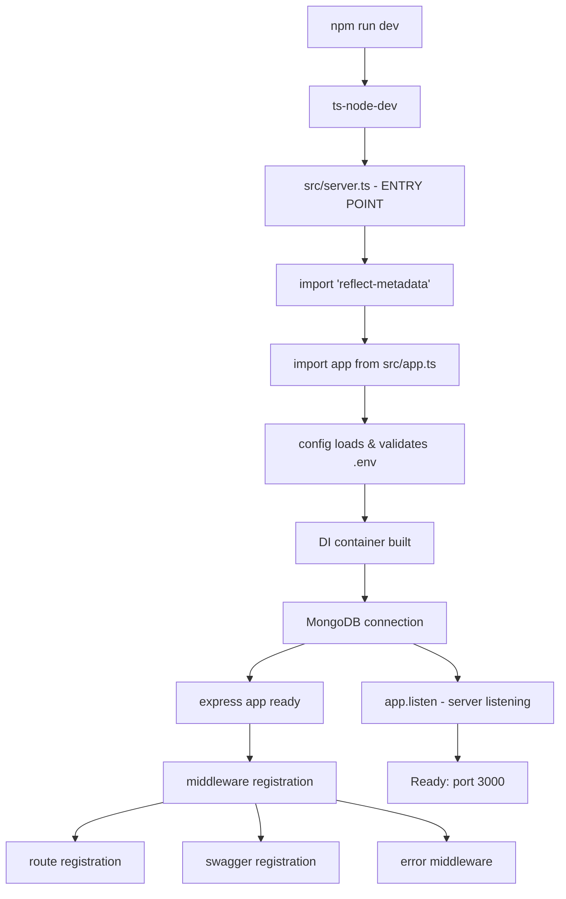
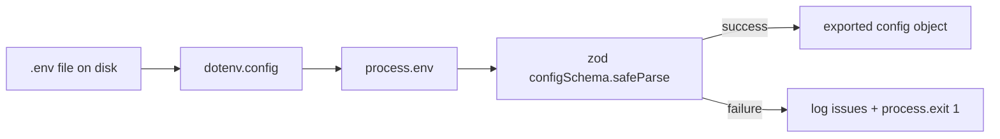
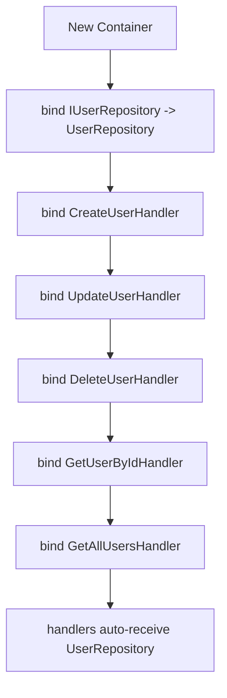
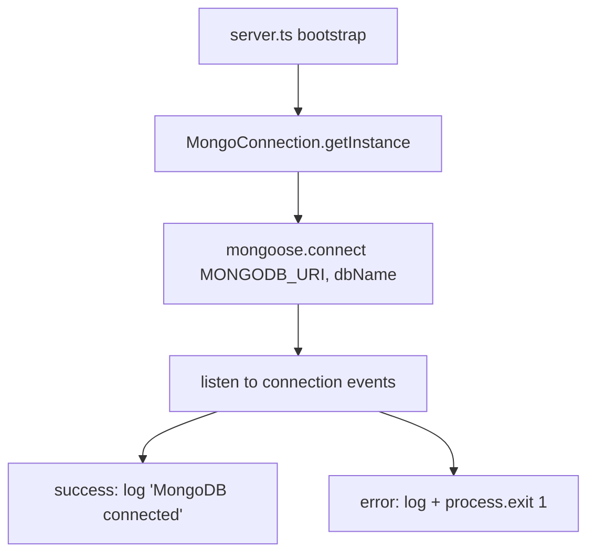
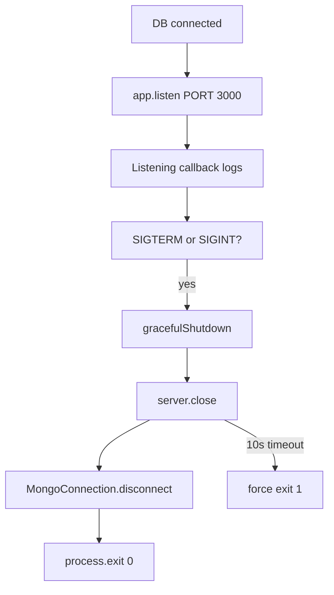
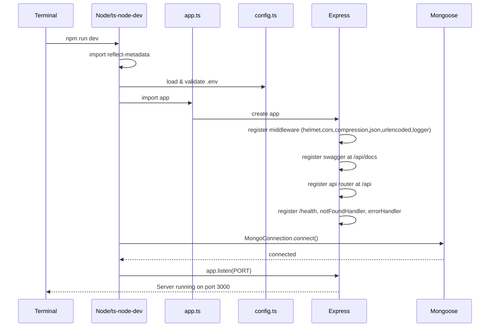

# 00 - Project Startup Flow

This document explains, in detail, exactly what happens on your machine from the moment you run
`npm run dev` until the HTTP server is listening and ready to accept requests.

It is written for a **frontend developer** with no backend assumptions. Nothing is skipped.

---

## 1. The Entry Command

```bash
npm run dev
```

`npm` reads `package.json` → the `scripts` section → the `dev` entry:

```json
"dev": "ts-node-dev --respawn --transpile-only src/server.ts"
```

What this actually runs:

```
ts-node-dev --respawn --transpile-only src/server.ts
```

| Piece | What it means |
| --- | --- |
| `ts-node-dev` | A development runner (like `nodemon`) that compiles TypeScript on the fly and restarts on file changes. |
| `--respawn` | Automatically restart the server whenever any file it depends on changes. |
| `--transpile-only` | Compile without full type-checking each run (faster). Types are still checked separately by `npm run build` / `tsc`. |
| `src/server.ts` | **The file that executes first — the entry point.** |

---

## 2. High-Level Startup Flow



---

## 3. Exactly What Each Import Does (server.ts)

`src/server.ts` is the entry point. Line by line:

```ts
import 'reflect-metadata';
```
Loads TypeScript's **reflection metadata** library. Without this, the InversifyJS dependency
injection decorators (`@injectable`, `@inject`) cannot read type information and DI fails.

```ts
import { app } from './app';
```
Pulls in the fully configured Express application. **Note:** importing `app` triggers `app.ts` to
run its top-level code (see below), building every middleware, route and swagger setup **before**
the connection is attempted.

```ts
import { config } from './config';
```
Loads `.env` and exposes strongly-typed config (`PORT`, `MONGODB_URI`, etc.).

```ts
import { logger } from './shared/utils/logger';
```
The Winston logger used for all output.

```ts
import { MongoConnection } from './infrastructure/database/mongoose/connection';
```
The MongoDB connection wrapper (singleton).

---

## 4. Environment Loading (in detail)

When `src/config/index.ts` is first imported:



1. `dotenv.config()` reads `.env` and populates `process.env`.
2. A **Zod schema** (`configSchema`) validates the values with types, ranges and defaults.
3. If validation fails, errors are printed and the process **exits with code 1** so you never run
   with broken config.
4. On success, a typed `config` object is exported and used everywhere (never read `process.env`
   directly elsewhere).

Config keys (from `.env` / `.env.example`):

| env var | config property | default | purpose |
| --- | --- | --- | --- |
| `PORT` | `config.port` | `3000` | HTTP port |
| `NODE_ENV` | `config.nodeEnv` | `development` | dev/production/test |
| `MONGODB_URI` | `config.mongoUri` | *(required)* | MongoDB connection string |
| `DB_NAME` | `config.dbName` | `thewovencloudkitchen` | MongoDB database name |
| `JWT_SECRET` | `config.jwtSecret` | *(required)* | JWT signing secret |
| `JWT_EXPIRES_IN` | `config.jwtExpiresIn` | `7d` | JWT lifetime |
| `API_PREFIX` | `config.apiPrefix` | `/api/v1` | API URL prefix |
| `LOG_LEVEL` | `config.logLevel` | `info` | winston log level |

Also exported: `isDev` and `isProd` booleans.

---

## 5. Express Initialization Flow (app.ts)

`src/app.ts` runs immediately when imported. It builds the whole app in this order:

```mermaid
flowchart TD
    A[create express app] --> B[helmet]
    B --> C[cors]
    C --> D[compression]
    D --> E[express.json limit 10mb]
    E --> F[express.urlencoded]
    F --> G[requestLogger]
    G --> H[swagger-ui at /api/docs]
    H --> I[api router at /api]
    I --> J[/health route]
    J --> K[notFoundHandler]
    K --> L[errorHandler]
```

Each middleware is registered **in order**, and order matters (see Best Practices in
[`docs/files/app.md`](files/app.md)):

1. **`helmet()`** — security headers.
2. **`cors()`** — allow cross-origin requests.
3. **`compression()`** — gzip responses.
4. **`express.json({ limit: '10mb' })`** — parse JSON request bodies.
5. **`express.urlencoded({ extended: true })`** — parse form bodies.
6. **`requestLogger`** — log every request/response.
7. **Swagger UI** at `/api/docs` (serves the OpenAPI definition).
8. **API router** mounted at `/api`.
9. **`/health`** route — liveness endpoint that reports DB state.
10. **`notFoundHandler`** — catch-all for unknown routes (404).
11. **`errorHandler`** — global error middleware (must be last).

---

## 6. Dependency Injection Flow

The container lives at `src/infrastructure/di/container.ts`. It is built the moment anything imports
it (controllers import it to resolve handlers).



- Handlers declare their dependency in their constructor: `@inject(TYPES.UserRepository) repository`.
- `container.get(TYPES.XHandler)` returns a fully-wired handler with its `UserRepository` injected.
- Controllers call `container.get(...)` lazily to obtain handlers.
- This decouples the "what" (interfaces) from the "how" (Mongoose implementation). See
  [`docs/folders/infrastructure.md`](folders/infrastructure.md) and [`docs/cqrs/`](cqrs/).

---

## 7. MongoDB Connection Flow

Performed by `MongoConnection.getInstance().connect()` inside `server.ts` bootstrap:



- `autoIndex` is `false` in production, `true` otherwise (determined by `isProd()`).
- Connection events (`connected`, `error`, `disconnected`) are logged for observability.
- **If the connection fails, the server exits** (does not silently start without a database).

---

## 8. Server Listening + Graceful Shutdown

After a successful DB connection, `bootstrap()` continues:

```ts
const server = app.listen(PORT, () => { /* logs */ });
```



- `SIGINT` = Ctrl+C in terminal.
- `SIGTERM` = termination request (e.g. Docker/Kubernetes).
- It also handles `unhandledRejection` and `uncaughtException` globally, logging them and exiting.

---

## 9. Final Ordered Startup Flow (complete)



---

## 10. Startup Files Summary

| File | Role at startup |
| --- | --- |
| `package.json` | Defines the `dev` script and dependencies |
| `src/server.ts` | **Entry point** — connects DB, starts listener, handles shutdown |
| `src/app.ts` | Builds Express app (middleware, routes, swagger, errors) |
| `src/config/index.ts` | Loads/validates `.env`, exports `config` |
| `src/infrastructure/di/container.ts` | Builds the DI container |
| `src/infrastructure/database/mongoose/connection.ts` | MongoDB connection |
| `src/config/swagger.config.ts` | Builds the OpenAPI spec |
| `src/api/routes/index.ts` | Registers API routes |

---

## Related Documents

- [01 - Request Flow](01-request-flow.md)
- [Folder Documentation](folders/) → start with [`src/`](folders/src.md)
- [File Documentation](files/) → start with [`app.md`](files/app.md) and [`server.md`](files/server.md)
- [Frontend Developer Guide](frontend-developer-guide.md)
- [Architecture](architecture.md)
