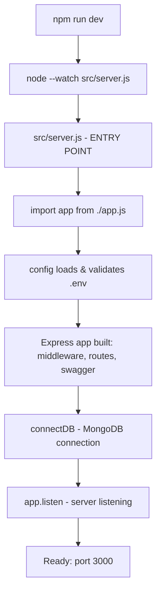
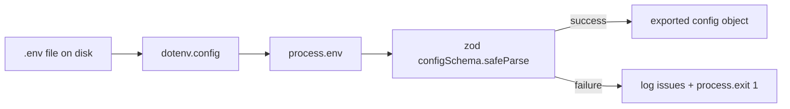
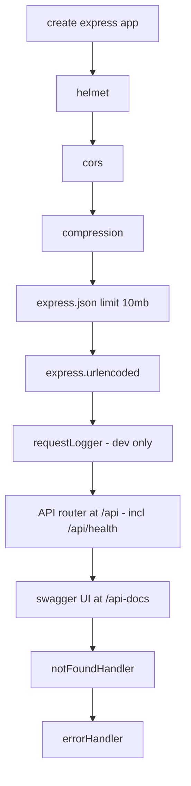
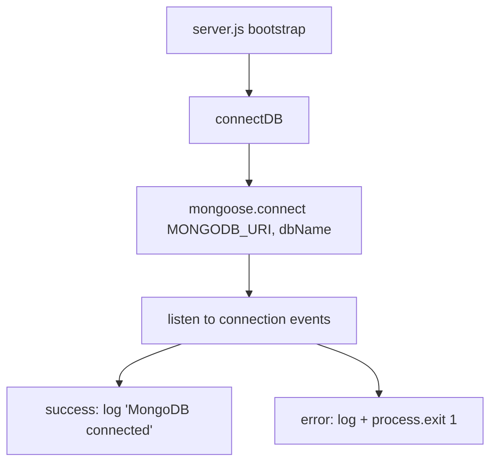
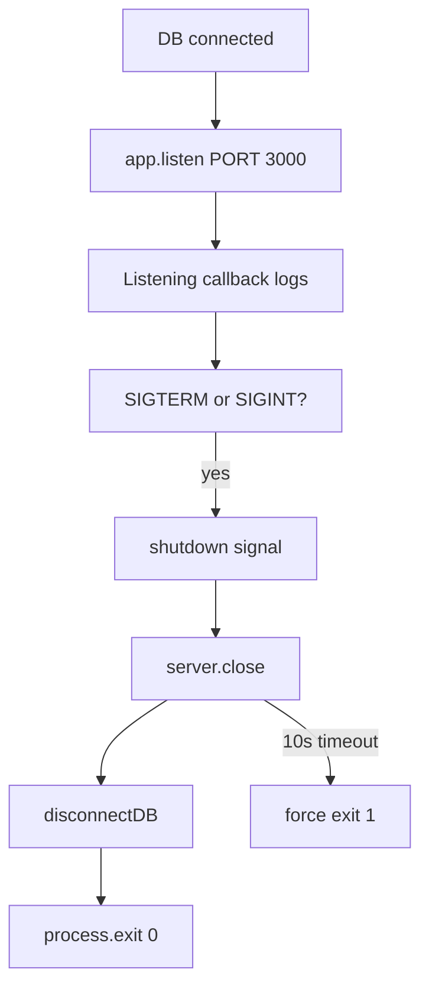
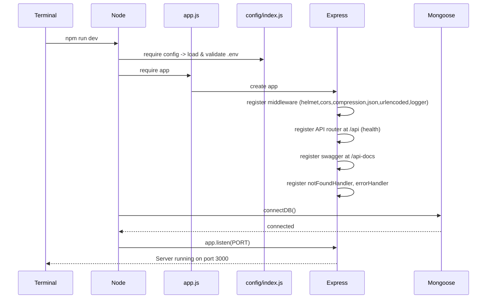

# 00 - Project Startup Flow

This document explains, in detail, exactly what happens on your machine from the moment you run
`npm run dev` until the HTTP server is listening and ready to accept requests.

It is written for a **frontend developer** with no backend assumptions. Nothing is skipped.

The backend is **plain JavaScript** (CommonJS) — there is no TypeScript and no build step. `node`
runs the `src/` files directly.

---

## 1. The Entry Command

```bash
npm run dev
```

`npm` reads `package.json` → the `scripts` section → the `dev` entry:

```json
"dev": "node --watch src/server.js"
```

What this actually runs:

```
node --watch src/server.js
```

| Piece | What it means |
| --- | --- |
| `node` | The Node.js runtime executes JavaScript directly (no compiler). |
| `--watch` | Node's built-in watcher: restarts the process whenever any loaded file changes (hot reload). |
| `src/server.js` | **The file that executes first — the entry point.** |

`npm start` runs the same file without the watcher (`node src/server.js`) for production-style runs.

---

## 2. High-Level Startup Flow



---

## 3. Exactly What Each Import Does (server.js)

`src/server.js` is the entry point:

```js
const app = require('./app');
const { connectDB, disconnectDB } = require('./infrastructure/database/mongoose/connection');
const { config } = require('./config');
const { logger } = require('./shared/utils/logger');
```

- `./app` — pulls in the fully configured Express application (middleware, routes, Swagger, error handling).
- `./infrastructure/database/mongoose/connection` — provides `connectDB()` / `disconnectDB()` for MongoDB.
- `./config` — loads `.env`, validates it with Zod, and exposes a `config` object (`port`, `mongoUri`, etc.).
- `./shared/utils/logger` — the Winston logger used for all output.

---

## 4. Environment Loading (in detail)

When `src/config/index.js` is first imported:



1. `dotenv.config()` reads `.env` and populates `process.env`.
2. A **Zod schema** (`configSchema`) validates the values with types, ranges and defaults.
3. If validation fails, the issues are printed and the process **exits with code 1** so you never run
   with broken config.
4. On success, a plain `config` object is exported and used everywhere (never read `process.env`
   directly elsewhere).

Config keys (from `.env` / `.env.example`):

| env var | config property | default | purpose |
| --- | --- | --- | --- |
| `NODE_ENV` | `config.nodeEnv` | `development` | `development` / `production` / `test` |
| `PORT` | `config.port` | `3000` | HTTP port |
| `MONGODB_URI` | `config.mongoUri` | *(required)* | MongoDB connection string |
| `DB_NAME` | `config.dbName` | `thewovencloudkitchen` | MongoDB database name |
| `API_PREFIX` | `config.apiPrefix` | `/api` | API URL prefix |
| `LOG_LEVEL` | `config.logLevel` | `info` | winston log level |

Also exported: `isProd` boolean.

---

## 5. Express Initialization Flow (app.js)

`src/app.js` runs immediately when imported. It builds the whole app in this order:



Each middleware is registered **in order**, and order matters (see Best Practices in
[`docs/files/app.md`](files/app.md)):

1. **`helmet()`** — security headers.
2. **`cors()`** — allow cross-origin requests.
3. **`compression()`** — gzip responses.
4. **`express.json({ limit: '10mb' })`** — parse JSON request bodies.
5. **`express.urlencoded({ extended: true })`** — parse form bodies.
6. **`requestLogger`** (dev only) — log every request/response via Winston.
7. **API router** mounted at `/api` — currently just `GET /api/health`.
8. **Swagger UI** at `/api-docs**` (serves the OpenAPI definition).
9. **`notFoundHandler`** — catch-all for unknown routes (404).
10. **`errorHandler`** — global error middleware (must be last).

---

## 6. MongoDB Connection Flow

Performed by `connectDB()` inside the `server.js` bootstrap:



- `mongoose.set('strictQuery', true)` is set once.
- `connectDB()` calls `mongoose.connect(config.mongoUri, { dbName, autoIndex: !isProd })`.
  - `autoIndex` is **false in production**, **true otherwise** (indexes not rebuilt in prod).
- Connection events (`connected`, `error`, `disconnected`) are logged for observability.
- **If the connection fails, the server exits** (does not silently start without a database).

---

## 7. Server Listening + Graceful Shutdown

After a successful DB connection, `start()` continues:

```js
server = app.listen(config.port, () => { /* logs */ });
```



- `SIGINT` = Ctrl+C in terminal.
- `SIGTERM` = termination request (e.g. Docker/Kubernetes).
- Graceful shutdown: stop accepting new connections, disconnect the DB, then exit cleanly, with a
  10-second forced-exit timeout as a safety net.

---

## 8. Final Ordered Startup Flow (complete)



---

## 9. Startup Files Summary

| File | Role at startup |
| --- | --- |
| `package.json` | Defines the `dev`/`start` scripts and dependencies |
| `src/server.js` | **Entry point** — connects DB, starts listener, handles shutdown |
| `src/app.js` | Builds Express app (middleware, routes, swagger, errors) |
| `src/config/index.js` | Loads/validates `.env`, exports `config` |
| `src/config/swagger.js` | Builds the OpenAPI spec |
| `src/api/routes/index.js` | Registers the API router (health) |
| `src/infrastructure/database/mongoose/connection.js` | MongoDB connection (`connectDB`) |

---

## Related Documents

- [01 - Request Flow](01-request-flow.md)
- [Folder Documentation](folders/) → start with [`src/`](folders/src.md)
- [File Documentation](files/) → start with [`app.md`](files/app.md) and [`server.md`](files/server.md)
- [Frontend Developer Guide](frontend-developer-guide.md)
- [Architecture](architecture.md)
