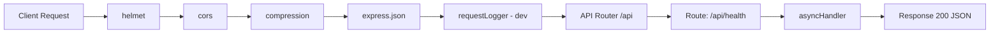

# 01 - Request Flow

This document traces a **single HTTP request** end-to-end, from the client through the current
plain-JavaScript middleware stack and back, using the one endpoint that exists today: `GET /api/health`.
It then explains the **planned** CQRS request path that future business endpoints will follow.

---

## 1. The Full Journey Today (Conceptual)

Every request passes through the global middleware registered in `src/app.js`:



---

## 2. The Only Endpoint: `GET /api/health`

### Step 1 — Client sends request

```http
GET /api/health HTTP/1.1
Host: localhost:3000
```

### Step 2 — Router (`src/api/routes/index.js`)

The router mounts the health router:

```js
router.use(require('./health.routes'));
```

So `/api/health` is handled by `src/api/routes/health.routes.js`. Inside it:

```js
router.get('/health', asyncHandler(async (req, res) => {
  res.status(200).json({ status: 'OK' });
}));
```

### Step 3 — `asyncHandler`

`asyncHandler` (from `src/shared/utils/async-handler.js`) is a tiny safety wrapper:

```js
const asyncHandler = (fn) => (req, res, next) => {
  Promise.resolve(fn(req, res, next)).catch(next);
};
```

If the handler ever throws, the rejection is forwarded to the Express error handler instead of
crashing the process.

### Step 4 — Response

The route responds directly with HTTP `200`:

```json
{ "status": "OK" }
```

There is **no** controller, no command/query, no handler class, no repository, and no database call.

---

## 3. The Error Path

If any middleware or handler throws, the error bubbles to the global `errorHandler`:

```mermaid
flowchart TD
    A[Middleware or handler throws] --> B[errorHandler]
    B --> C{is AppError?}
    C -->|yes| D[status from error, { success:false, message, code }]
    C -->|no| E[500 generic]
```

- **`AppError`** subclasses (from `src/shared/errors/`) carry a status code and a machine-readable code.
- Unmatched routes fall through to `notFoundHandler`, returning `404 { "success": false, "message": "Route not found", "code": "NOT_FOUND" }`.

---

## 4. The Planned CQRS Path (future business endpoints)

Story 0.2 deliberately ships **no** business endpoints. For future stories, the request flow will
follow the Clean Architecture + CQRS wiring the folders are scaffolded for:

```mermaid
flowchart TD
    A[Client Request] --> B[Route + validate middleware (Zod)]
    B -->|valid| C[Controller]
    B -->|invalid| E[ValidationError -> 400]
    C --> D[Command or Query]
    D --> F[Handler .execute]
    F --> G[Repository (port/adapter)]
    G --> H[Mongoose Model]
    H --> I[MongoDB]
```

- **Route + validation** lives in `src/api/routes/` using the `validate` middleware (Zod).
- **Controller** (`src/api/controllers/`) translates HTTP → command/query and formats the response.
- **Command / Query** (`src/application/commands|queries/`) are plain data objects.
- **Handler** (`src/application/handlers/`) holds the business logic.
- **Repository** (`src/infrastructure/repositories/` + `src/domain/repositories/`) is the DB bridge.

None of this is implemented yet — the folders are empty scaffolding (`.gitkeep`).

---

## 5. Mapping: today vs planned

| Step | Today (`/api/health`) | Planned (business endpoint) |
| --- | --- | --- |
| Route | `api/routes/health.routes.js` | `api/routes/<feature>.routes.js` |
| Validation | none | `validate` Zod middleware |
| Controller | none (inline handler) | `api/controllers/*` |
| Command/Query | none | `application/commands|queries/*` |
| Handler | none | `application/handlers/*` |
| Repository | none | `infrastructure/repositories/*` |
| Response | inline `res.status(200).json(...)` | `shared/utils/response` helpers |

---

## Related Documents

- [00 - Project Startup Flow](00-project-startup-flow.md)
- [Folders](folders/) — see [api.md](folders/api.md), [application.md](folders/application.md)
- [CQRS](cqrs/)
- [API docs](apis/)
- [Database](database.md)
- [Frontend Developer Guide](frontend-developer-guide.md)
