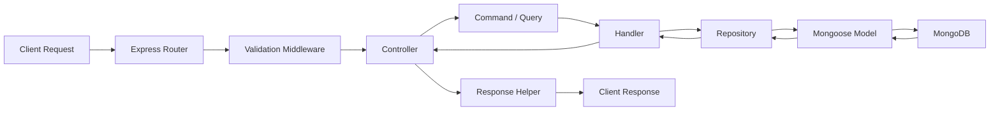
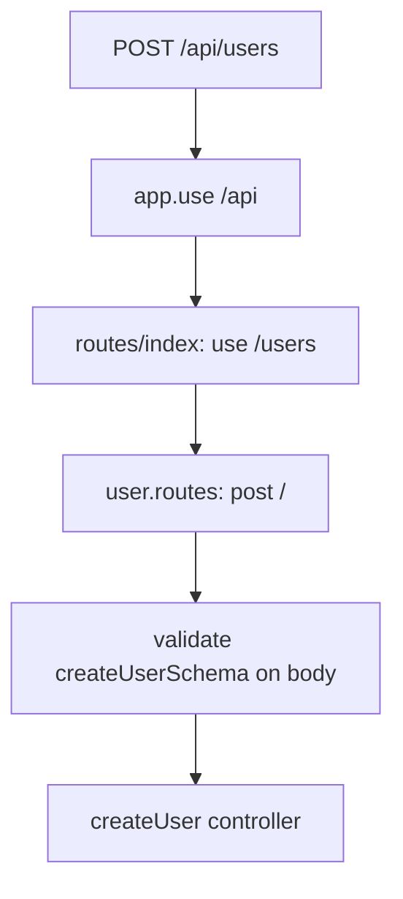
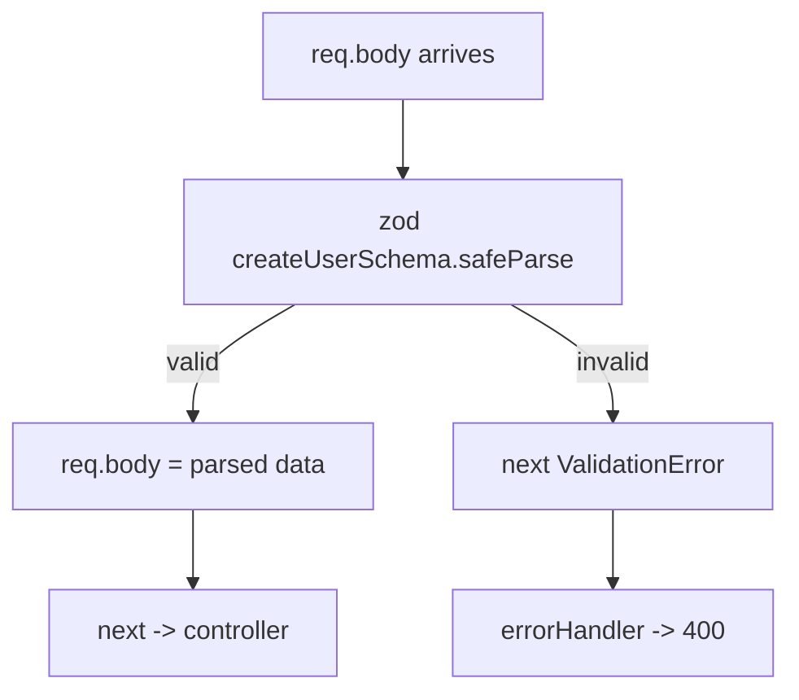
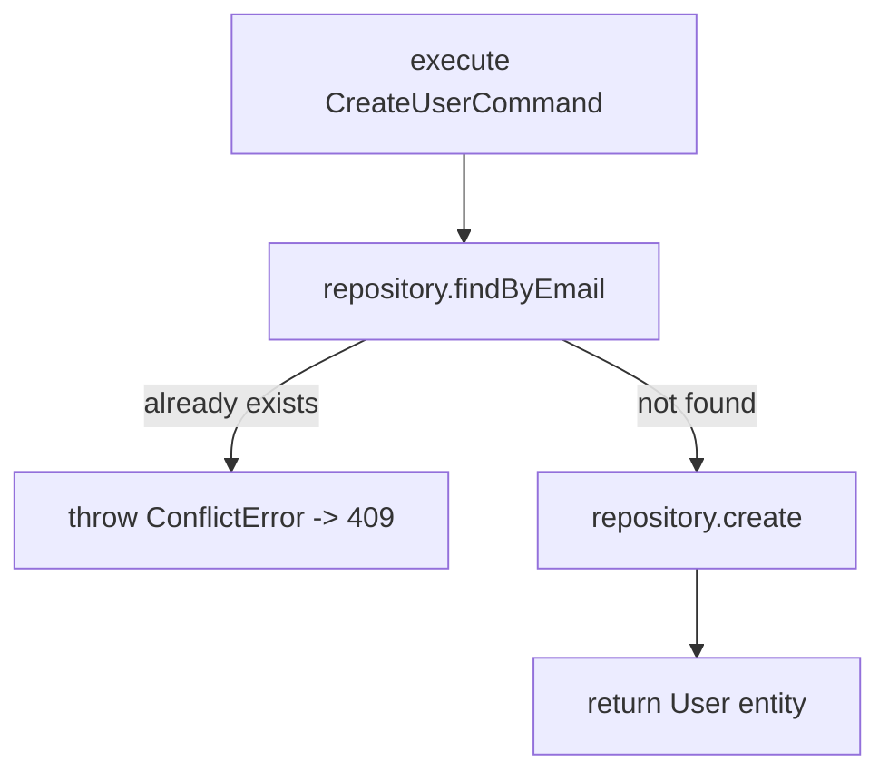
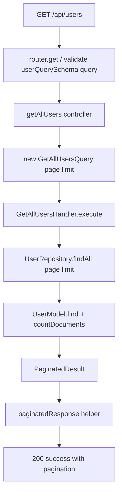
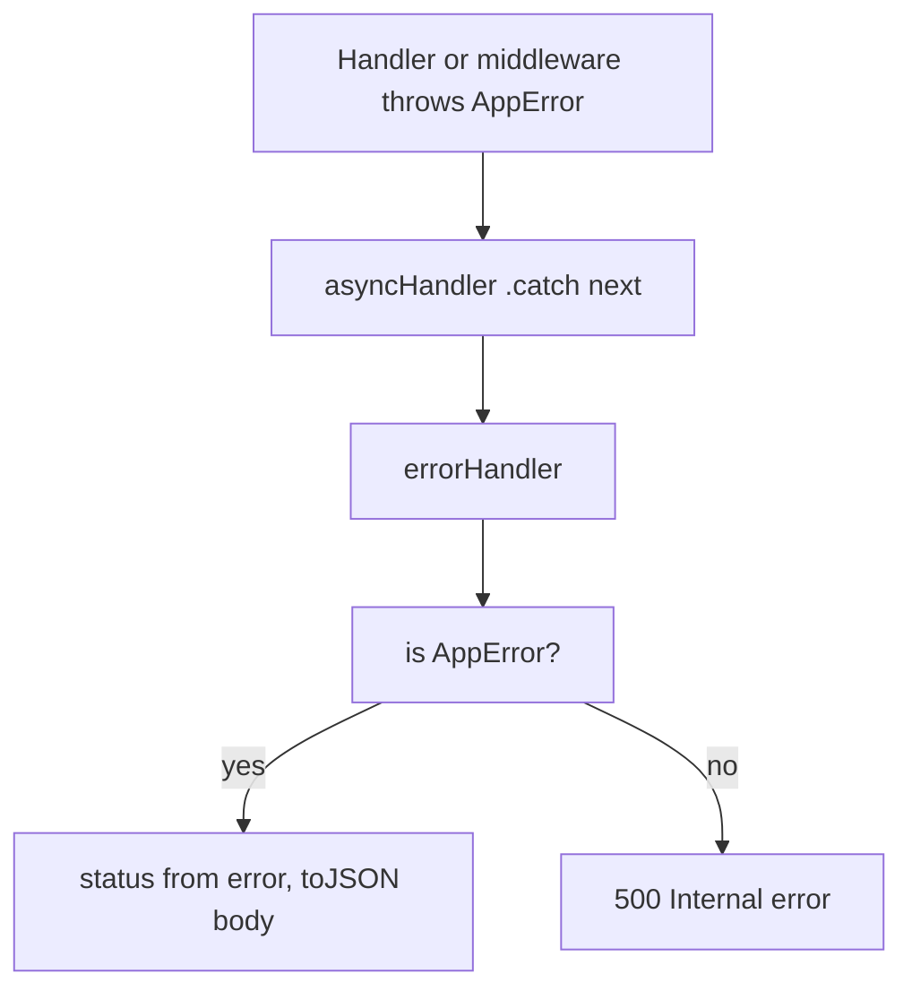
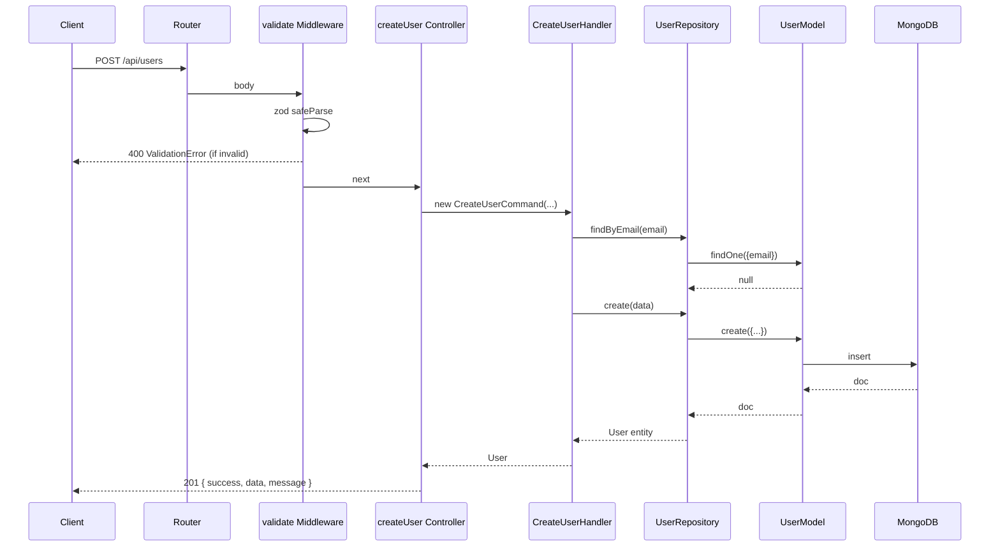

# 01 - Request Flow

This document traces a **single HTTP request** end-to-end, from the client to MongoDB and back,
with a concrete example from this project (`Create a new user`).

---

## 1. The Full Journey (Conceptual)



---

## 2. Real Example: `POST /api/users` (Create User)

Walkthrough step by step.

### Step 0 — Client sends request

```
POST /api/users
Content-Type: application/json

{
  "email": "chef@thewovencloudkitchen.com",
  "name": "Chef Owner",
  "role": "ADMIN"
}
```

### Step 1 — Router (`src/api/routes/index.ts` + `user.routes.ts`)

The root router mounts feature routers:

```ts
router.use('/users', userRouter);
```

So `/api/users` is handled by `userRouter`. Inside `user.routes.ts` the matching rule is:

```ts
router.post('/', validate(createUserSchema, 'body'), createUser);
```

Flow:



### Step 2 — Validation middleware (`validate`)

Before the controller runs, `validate(createUserSchema, 'body')` runs `createUserSchema.safeParse(req.body)`.

- **Valid** → the parsed body replaces `req.body`, then `next()` → controller.
- **Invalid** → `next(new ValidationError(...))` is called; the request **jumps straight to the error
  middleware** (the controller never runs). Response: `400 VALIDATION_ERROR` with a `errors` map.



### Step 3 — Controller (`getUserById`-style funnel: `createUser`)

The controller is the HTTP ↔ application translator. It:

1. Casts `req.body` to the input type.
2. Builds a **command object**: `new CreateUserCommand(email, name, role)`.
3. Resolves the handler from the DI container and calls `handler.execute(command)`.
4. Sends the HTTP response via a response helper.

```ts
export const createUser = asyncHandler(async (req, res) => {
  const data = req.body as CreateUserInput;
  const user = await createUserHandler().execute(
    new CreateUserCommand(data.email, data.name, data.role)
  );
  createdResponse(res, user, 'User created successfully');
});
```

### Step 4 — Command object

```ts
new CreateUserCommand("chef@thewovencloudkitchen.com", "Chef Owner", "ADMIN")
```

Just data. No logic, no database. It carries:
- `email: string`
- `name: string`
- `role?: UserRole`

### Step 5 — Handler (`CreateUserHandler.execute`)

The handler contains the **business logic** and orchestrates the repository:

```ts
async execute(command: CreateUserCommand): Promise<User> {
  const existing = await this.userRepository.findByEmail(command.email);
  if (existing) throw new ConflictError('User with this email already exists');
  return this.userRepository.create({ ... });
}
```



### Step 6 — Repository (`UserRepository`)

The repository is the **Mongoose adapter**. It converts domain data to a Mongo document and back.

```ts
async create(data: CreateUserData): Promise<User> {
  const doc = await UserModel.create({ ...data, email: data.email.toLowerCase() });
  return this.mapToEntity(doc.toObject());
}
```

### Step 7 — Mongoose Model (`UserModel`)

`UserModel.create(...)` executes the MongoDB insert. The schema enforces fields, defaults, unique
email index, and adds `_id`, `createdAt`, `updatedAt` timestamps automatically.

### Step 8 — MongoDB

MongoDB stores the document in the `users` collection of the `thewovencloudkitchen` database.

### Step 9 — Response Propagation (back up the chain)

The created document flows: `MongoDB → UserModel → Repository → Handler → Controller`.

The `mapToEntity` converts `_id` (ObjectId) → `id` (string) and shapes the plain domain `User` object.

### Step 10 — Response Helper

The controller calls `createdResponse(res, user, 'User created successfully')` → `successResponse`
with status `201`.

```mermaid
flowchart LR
    A[User entity] --> B[createdResponse]
    B --> C[{ success, data, message }]
    C --> D[res.status 201 .json]
```

### Step 11 — Client receives response

```json
{
  "success": true,
  "data": {
    "id": "6653f1a2...",
    "email": "chef@thewovencloudkitchen.com",
    "name": "Chef Owner",
    "role": "ADMIN",
    "isActive": true,
    "createdAt": "2025-...",
    "updatedAt": "2025-..."
  },
  "message": "User created successfully"
}
```

---

## 3. Read Request Example: `GET /api/users?page=1&limit=20`

Same journey, but through the **query path** (CQRS read side):



Key difference from the write path: it uses a **Query** + **Query Handler** + read-only repository
methods, and returns a paginated envelope.

---

## 4. The Error Path

When any step throws, the error bubbles to `asyncHandler`, which forwards it to the global
`errorHandler`:



Example — duplicate email:

```json
{
  "status": "error",
  "message": "User with this email already exists",
  "code": "CONFLICT"
}
```

Status: `409`.

---

## 5. Full Sequence Diagram for `POST /api/users`



---

## Related Documents

- [00 - Project Startup Flow](00-project-startup-flow.md)
- [Folders](folders/) — see [api.md](folders/api.md), [application.md](folders/application.md)
- [CQRS](cqrs/)
- [API docs](apis/)
- [Database](database.md)
- [Frontend Developer Guide](frontend-developer-guide.md)
