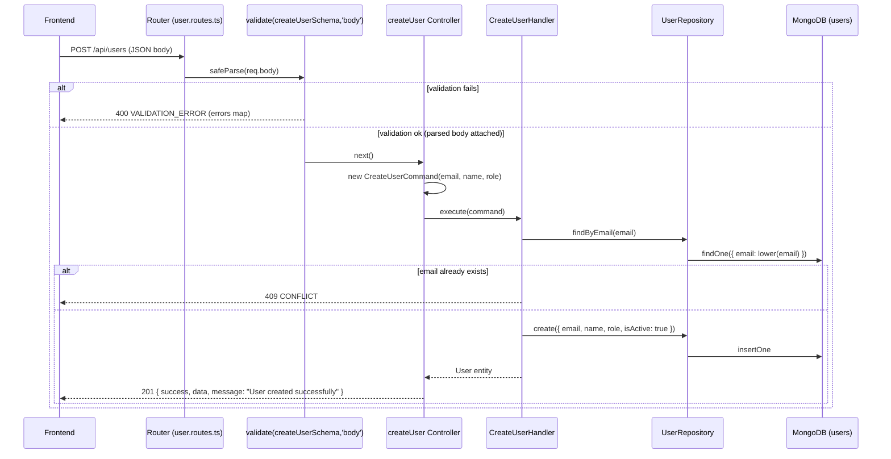

# API: POST /api/users

## Summary

Creates a new user. Returns the created user document with HTTP `201`. Rejects the request with `409` if a user with the same email already exists.

## Method

`POST`

## URL

`/api/users`

## Middleware

- `validate(createUserSchema, 'body')` — zod schema `createUserSchema` applied to `req.body` (`src/api/routes/user.routes.ts:10`).
- Controller is wrapped with `asyncHandler` (`src/shared/utils/async-handler.ts`) so thrown errors reach the global `errorHandler`.
- No `authenticate` / `authorize` middleware is applied on this route.
- Global middleware also runs: `helmet`, `cors`, `compression`, `express.json({ limit: '10mb' })`, `requestLogger`, then `errorHandler`.

## Validation

Schema: `createUserSchema` (`src/application/dto/user.dto.ts`)

| Field   | Type   | Required | Rules                                                        |
| ------- | ------ | -------- | ------------------------------------------------------------ |
| `email` | string | Yes      | Must be a valid email format (`z.string().email`)            |
| `name`  | string | Yes      | Min length `1`, max length `100`                             |
| `role`  | enum   | No       | One of `ADMIN` \| `MANAGER` \| `STAFF`. Omitted → defaults to `STAFF` (applied in handler) |

On failure the middleware builds an `errors` map keyed by the flattened zod path and throws `ValidationError('Validation failed', errors)` → HTTP `400`.

## Controller

`createUser` — `src/api/controllers/user.controller.ts:107`

## Command/Query

Constructed: `new CreateUserCommand(data.email, data.name, data.role)`

Source: `src/application/commands/create-user.command.ts` — args `(email: string, name: string, role?: UserRole)`.

## Handler

`CreateUserHandler.execute(command)` — `src/application/handlers/create-user.handler.ts`

Logic: checks `findByEmail(email)` → throws `ConflictError` if it exists; otherwise creates with `role` defaulting to `UserRole.STAFF` and `isActive: true`.

## Repository

`UserRepository` (`src/infrastructure/repositories/user.repository.ts`):

- `findByEmail(email)` — duplicate email pre-check.
- `create({ email, name, role, isActive })` — persists the document.

## Database Operation

Mongoose `UserModel` on the `users` collection:

1. `UserModel.findOne({ email: email.toLowerCase() })` — duplicate check (case-insensitive via normalization).
2. `UserModel.create({ email: email.toLowerCase(), name, role, isActive })` — insert.

`createdAt` / `updatedAt` are managed by the mongoose timestamp option.

## Request Example

```http
POST /api/users
Content-Type: application/json

{
  "email": "jane.doe@twk.com",
  "name": "Jane Doe",
  "role": "MANAGER"
}
```

Note: `role` is optional — omit it to receive the `STAFF` default. The email is normalized to lowercase server-side.

## Response Example

HTTP `201 Created` — `createdResponse` helper shape (`src/shared/utils/response.ts`):

```json
{
  "success": true,
  "data": {
    "id": "664f2c9d1a2b3c4d5e6f7a8b",
    "email": "jane.doe@twk.com",
    "name": "Jane Doe",
    "role": "MANAGER",
    "isActive": true,
    "createdAt": "2026-08-27T09:15:00.000Z",
    "updatedAt": "2026-08-27T09:15:00.000Z"
  },
  "message": "User created successfully"
}
```

## Error Responses

| Status | Condition                                        | Code               | Body Example                                                                                                                        |
| ------ | ------------------------------------------------ | ------------------ | ----------------------------------------------------------------------------------------------------------------------------------- |
| `400`  | Zod validation failure on body                   | `VALIDATION_ERROR` | `{ "status": "error", "message": "Validation failed", "code": "VALIDATION_ERROR", "errors": { "email": ["Invalid email format"], "name": ["Name is required"] } }` |
| `409`  | A user with this email already exists            | `CONFLICT`         | `{ "status": "error", "message": "User with this email already exists", "code": "CONFLICT" }`                                       |
| `500`  | Unhandled error (e.g. database unreachable)      | `INTERNAL_ERROR`   | `{ "status": "error", "message": "Internal server error", "code": "INTERNAL_ERROR" }` (dev adds `stack`)                            |

Error bodies come from `AppError.toJSON()` in `src/shared/errors/*` (the route-level `errorResponse` helper is not used by the error handler).

## Flow Diagram

