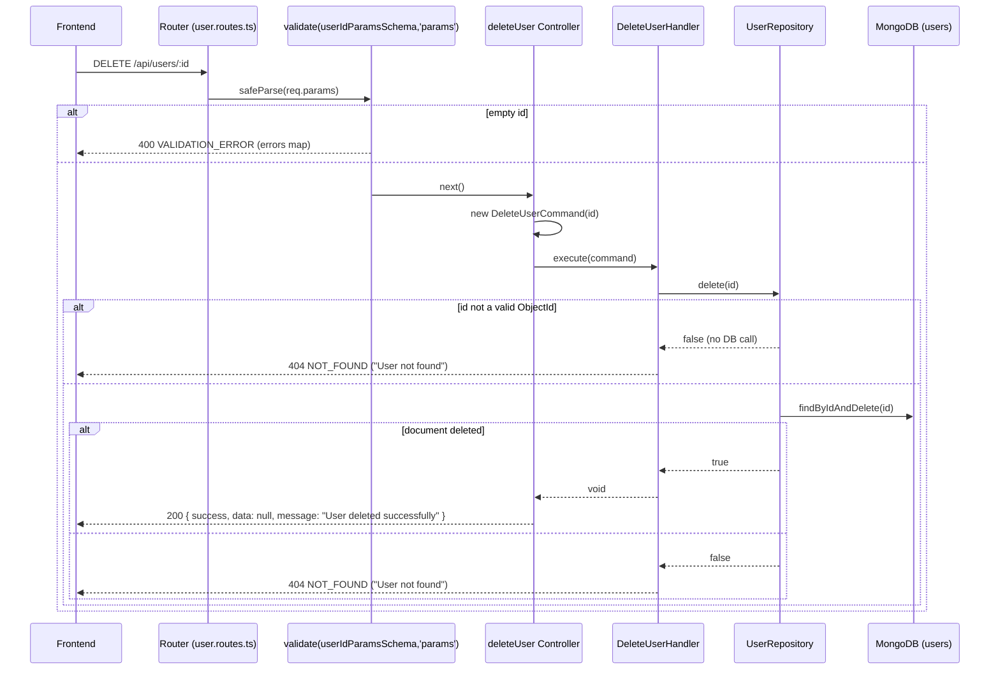

# API: DELETE /api/users/:id

## Summary

Deletes a user identified by its MongoDB ObjectId. Responds `404` if the id is invalid or the user does not exist. On success the response body carries `data: null` plus a confirmation message.

## Method

`DELETE`

## URL

`/api/users/:id`

Path parameter:

| Param | Type   | Required | Description                 |
| ----- | ------ | -------- | --------------------------- |
| `id`  | string | Yes      | MongoDB ObjectId (24 hex `[0-9a-f]`) |

## Middleware

- `validate(userIdParamsSchema, 'params')` — zod schema `userIdParamsSchema` applied to `req.params` (`src/api/routes/user.routes.ts:12`).
- Controller is wrapped with `asyncHandler`.
- No `authenticate` / `authorize` middleware on this route.

## Validation

Schema: `userIdParamsSchema` (`src/application/dto/user.dto.ts`)

| Field | Type   | Required | Rules                              |
| ----- | ------ | -------- | ---------------------------------- |
| `id`  | string | Yes      | `z.string().min(1, 'id is required')` |

A non-ObjectId string passes route validation but results in `404` downstream because `UserRepository.delete` returns `false` for invalid ids.

## Controller

`deleteUser` — `src/api/controllers/user.controller.ts:160`

## Command/Query

Constructed: `new DeleteUserCommand(id)`

Source: `src/application/commands/delete-user.command.ts` — args `(id: string)`.

## Handler

`DeleteUserHandler.execute(command)` — `src/application/handlers/delete-user.handler.ts`

Logic: calls `delete(id)`; throws `NotFoundError('User')` when it returns `false`.

## Repository

`UserRepository`:

- `delete(id)` — returns `true` if a document was removed, `false` otherwise.

## Database Operation

Mongoose `UserModel` on the `users` collection:

- Guard: `Types.ObjectId.isValid(id)` — returns `false` immediately if the id is not a valid ObjectId.
- `UserModel.findByIdAndDelete(id)` — removes the document. Returns `null` (→ `false`) when no match.

## Request Example

```http
DELETE /api/users/664f2c9d1a2b3c4d5e6f7a8b
```

No body required.

## Response Example

HTTP `200 OK` — `successResponse` helper shape (`src/shared/utils/response.ts`) with `null` data:

```json
{
  "success": true,
  "data": null,
  "message": "User deleted successfully"
}
```

## Error Responses

| Status | Condition                                                   | Code               | Body Example                                                                                                                        |
| ------ | ----------------------------------------------------------- | ------------------ | ----------------------------------------------------------------------------------------------------------------------------------- |
| `400`  | Empty/blank `id` param (fails `min(1)`)                     | `VALIDATION_ERROR` | `{ "status": "error", "message": "Validation failed", "code": "VALIDATION_ERROR", "errors": { "id": ["id is required"] } }`         |
| `404`  | Id is not a valid ObjectId, or user does not exist          | `NOT_FOUND`        | `{ "status": "error", "message": "User not found", "code": "NOT_FOUND" }`                                                             |
| `500`  | Unhandled error (e.g. database unreachable)                 | `INTERNAL_ERROR`   | `{ "status": "error", "message": "Internal server error", "code": "INTERNAL_ERROR" }`                                                  |

Error bodies come from `AppError.toJSON()` in `src/shared/errors/*`. Deleting an already-deleted user is not idempotent at the API layer — a second delete of a non-existent id returns `404`.

## Flow Diagram

