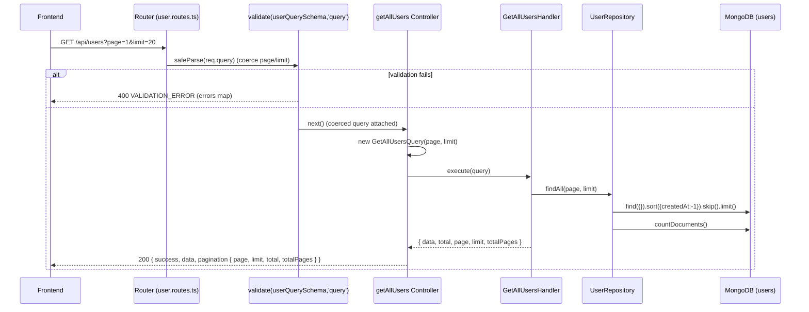

# API: GET /api/users

## Summary

Returns a paginated, newest-first list of all users. Pagination is controlled by the `page` and `limit` query parameters.

## Method

`GET`

## URL

`/api/users?page=1&limit=20`

## Middleware

- `validate(userQuerySchema, 'query')` — zod schema `userQuerySchema` applied to `req.query` (`src/api/routes/user.routes.ts:8`).
- Controller is wrapped with `asyncHandler`.
- No `authenticate` / `authorize` middleware on this route.

## Validation

Schema: `userQuerySchema` (`src/application/dto/user.dto.ts`)

| Field   | Type   | Required | Rules                                                        |
| ------- | ------ | -------- | ------------------------------------------------------------ |
| `page`  | number | No       | Coerced (`z.coerce.number()`), integer, min `1`. Default `1` |
| `limit` | number | No       | Coerced, integer, min `1`, max `100`. Default `20`           |

Because `z.coerce` is used, string query values like `?page=2&limit=50` are parsed into numbers. Both default if omitted.

## Controller

`getAllUsers` — `src/api/controllers/user.controller.ts:44`

## Command/Query

Constructed: `new GetAllUsersQuery(page, limit)`

Source: `src/application/queries/get-all-users.query.ts` — args `(page = 1, limit = 20)`.

## Handler

`GetAllUsersHandler.execute(query)` — `src/application/handlers/get-all-users.handler.ts`

Logic: calls `findAll(page, limit)`, computes `totalPages = Math.ceil(total / limit)`, returns `{ data, total, page, limit, totalPages }`.

## Repository

`UserRepository`:

- `findAll(page, limit)` — returns `{ data, total }` via a parallel fetch of documents and count.

## Database Operation

Mongoose `UserModel` on the `users` collection:

- `UserModel.find({}).sort({ createdAt: -1 }).skip((page - 1) * limit).limit(limit).lean()` — newest first.
- `UserModel.countDocuments()` — total count (run via `Promise.all`).

## Request Example

```http
GET /api/users?page=1&limit=20
```

Both parameters optional. e.g. `GET /api/users` is equivalent to `GET /api/users?page=1&limit=20`.

## Response Example

HTTP `200 OK` — `paginatedResponse` helper shape (`src/shared/utils/response.ts`):

```json
{
  "success": true,
  "data": [
    {
      "id": "664f2c9d1a2b3c4d5e6f7a8b",
      "email": "jane.doe@twk.com",
      "name": "Jane Doe",
      "role": "MANAGER",
      "isActive": true,
      "createdAt": "2026-08-27T09:15:00.000Z",
      "updatedAt": "2026-08-27T09:15:00.000Z"
    },
    {
      "id": "664f2c111a2b3c4d5e6f7a9c",
      "email": "john@twk.com",
      "name": "John Smith",
      "role": "STAFF",
      "isActive": false,
      "createdAt": "2026-08-26T14:02:00.000Z",
      "updatedAt": "2026-08-26T14:02:00.000Z"
    }
  ],
  "pagination": {
    "page": 1,
    "limit": 20,
    "total": 2,
    "totalPages": 1
  }
}
```

`data` is empty (`[]`) when there are no users; `total` reflects the real count.

## Error Responses

| Status | Condition                                     | Code               | Body Example                                                                                                  |
| ------ | --------------------------------------------- | ------------------ | ------------------------------------------------------------------------------------------------------------- |
| `400`  | Zod validation failure on query               | `VALIDATION_ERROR` | `{ "status": "error", "message": "Validation failed", "code": "VALIDATION_ERROR", "errors": { "limit": ["Number must be less than or equal to 100"] } }` |
| `500`  | Unhandled error (e.g. database unreachable)   | `INTERNAL_ERROR`   | `{ "status": "error", "message": "Internal server error", "code": "INTERNAL_ERROR" }`                          |

Error bodies come from `AppError.toJSON()` in `src/shared/errors/*`.

## Flow Diagram

