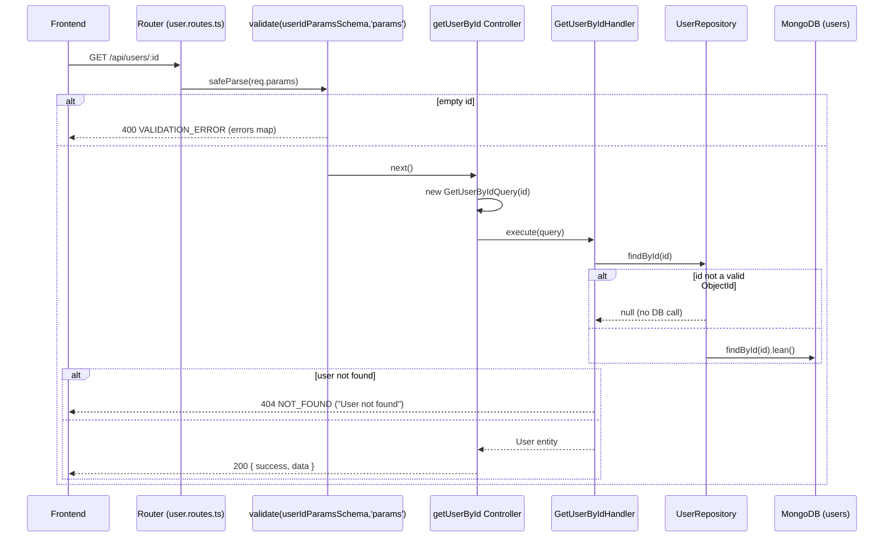

# API: GET /api/users/:id

## Summary

Returns a single user by its MongoDB ObjectId. Responds `404` if the id is invalid (not a MongoDB ObjectId) or the user does not exist.

## Method

`GET`

## URL

`/api/users/:id`

Path parameter:

| Param | Type   | Required | Description                 |
| ----- | ------ | -------- | --------------------------- |
| `id`  | string | Yes      | MongoDB ObjectId (24 hex `[0-9a-f]`) |

## Middleware

- `validate(userIdParamsSchema, 'params')` — zod schema `userIdParamsSchema` applied to `req.params` (`src/api/routes/user.routes.ts:9`).
- Controller is wrapped with `asyncHandler`.
- No `authenticate` / `authorize` middleware on this route.

## Validation

Schema: `userIdParamsSchema` (`src/application/dto/user.dto.ts`)

| Field | Type   | Required | Rules                              |
| ----- | ------ | -------- | ---------------------------------- |
| `id`  | string | Yes      | `z.string().min(1, 'id is required')` |

Note: this schema only requires a non-empty string. A non-ObjectId value passes validation at the route layer but results in `404` downstream, because `UserRepository.findById` returns `null` for invalid ObjectIds (`Types.ObjectId.isValid(id) === false`).

## Controller

`getUserById` — `src/api/controllers/user.controller.ts:73`

## Command/Query

Constructed: `new GetUserByIdQuery(id)`

Source: `src/application/queries/get-user-by-id.query.ts` — args `(id: string)`.

## Handler

`GetUserByIdHandler.execute(query)` — `src/application/handlers/get-user-by-id.handler.ts`

Logic: calls `findById(id)`; throws `NotFoundError('User')` when `null` is returned.

## Repository

`UserRepository`:

- `findById(id)` — returns the mapped `User` entity or `null`.

## Database Operation

Mongoose `UserModel` on the `users` collection:

- `UserModel.findById(id).lean()` — single document lookup.
- Guards: if `Types.ObjectId.isValid(id)` is `false`, returns `null` immediately without hitting the database.

## Request Example

```http
GET /api/users/664f2c9d1a2b3c4d5e6f7a8b
```

## Response Example

HTTP `200 OK` — `successResponse` helper shape (`src/shared/utils/response.ts`):

```json
{
  "success": true,
  "data": {
    "id": "664f2c9d1a2b3c4d5e6f7a8b",
    "email": "jane.doe@twk.com",
    "name": "Jane Doe",
    "role": "MANAGER",
    "isActive": true,
    "createdAt": "2026-08-27T09:15:00.000Z",
    "updatedAt": "2026-08-27T09:15:00.000Z"
  }
}
```

## Error Responses

| Status | Condition                                                   | Code               | Body Example                                                                                                                        |
| ------ | ----------------------------------------------------------- | ------------------ | ----------------------------------------------------------------------------------------------------------------------------------- |
| `400`  | Empty/blank `id` param (fails `min(1)`)                     | `VALIDATION_ERROR` | `{ "status": "error", "message": "Validation failed", "code": "VALIDATION_ERROR", "errors": { "id": ["id is required"] } }`         |
| `404`  | Id is not a valid ObjectId, or user does not exist          | `NOT_FOUND`        | `{ "status": "error", "message": "User not found", "code": "NOT_FOUND" }`                                                             |
| `500`  | Unhandled error (e.g. database unreachable)                 | `INTERNAL_ERROR`   | `{ "status": "error", "message": "Internal server error", "code": "INTERNAL_ERROR" }`                                                  |

Error bodies come from `AppError.toJSON()` in `src/shared/errors/*`.

## Flow Diagram

