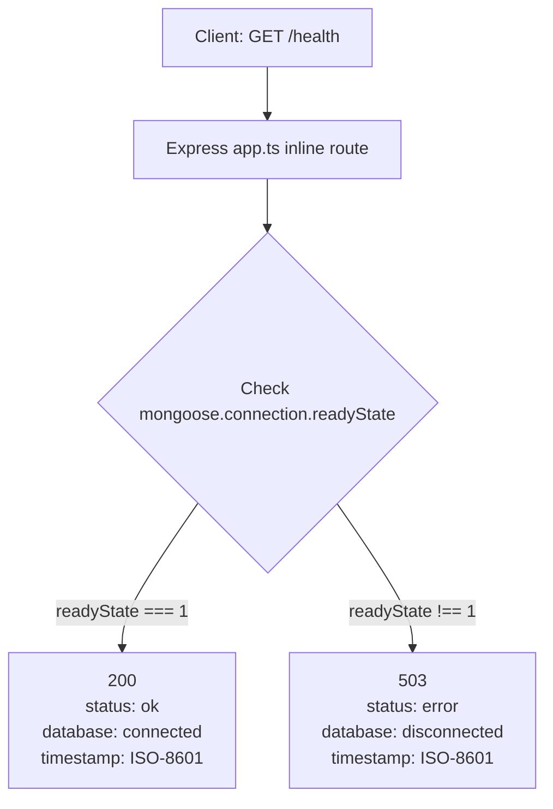

# API: GET /health

## Summary

Liveness + database connectivity check. Returns `200 ok` when MongoDB is connected and `503 error` when it is not. Does not require authentication.

## Method

`GET`

## URL

`/health`

## Middleware

None beyond global app middleware (`helmet`, `cors`, `compression`, `express.json`, `requestLogger`). This is a **plain inline Express route** (`src/app.ts:52`) — it does not go through `validate`, the Clean Architecture pipeline, or any auth middleware. Also note the route is registered at the app root (`/health`), **not** under `/api`.

## Validation

None — the route accepts query parameters, a body, or nothing; nothing is validated.

## Controller

N/A — no controller. The response is written inline in `src/app.ts:52`.

## Command/Query

N/A — no command or query object is constructed.

## Handler

N/A — no application-layer handler is involved.

## Repository

N/A — the repository layer is not used. Connectivity is checked directly via `mongoose.connection.readyState`.

## Database Operation

Checked: `mongoose.connection.readyState`

- `readyState === 1` → database considered `connected`.
- Any other state (`0` disconnected, `2` connecting, `3` disconnecting, `99` uninitialized) → considered `disconnected`.

No database I/O is performed by this endpoint.

## Request Example

```http
GET /health
```

No query params or body required.

## Response Example

HTTP `200 OK` (database connected):

```json
{
  "status": "ok",
  "database": "connected",
  "timestamp": "2026-08-27T09:30:00.000Z"
}
```

HTTP `503 Service Unavailable` (database not connected):

```json
{
  "status": "error",
  "database": "disconnected",
  "timestamp": "2026-08-27T09:30:00.000Z"
}
```

`timestamp` is the server's current UTC time in ISO 8601.

## Error Responses

| Status | Condition                          | Body Example                                                    |
| ------ | ---------------------------------- | --------------------------------------------------------------- |
| `503`  | `mongoose.connection.readyState !== 1` | `{ "status": "error", "database": "disconnected", "timestamp": "<ISO-8601>" }` |

Note: this endpoint is not JSON-shape compliant with `successResponse` / `errorResponse` helpers or `AppError.toJSON()` — it emits its own fixed shape (`status`, `database`, `timestamp`). The global `notFoundHandler` still applies to unmatched routes elsewhere (`{ "status": "error", "message": "Route not found", "code": "NOT_FOUND" }` at `404`).

## Flow Diagram

