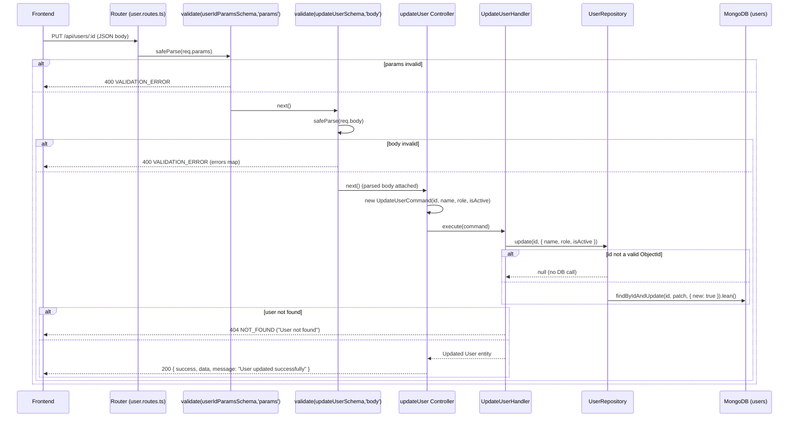

# API: PUT /api/users/:id

## Summary

Partially updates an existing user identified by its MongoDB ObjectId. Only the fields present in the body are patched (all body fields are optional). Responds `404` if the id is invalid or the user does not exist.

## Method

`PUT`

## URL

`/api/users/:id`

Path parameter:

| Param | Type   | Required | Description                 |
| ----- | ------ | -------- | --------------------------- |
| `id`  | string | Yes      | MongoDB ObjectId (24 hex `[0-9a-f]`) |

## Middleware

- `validate(userIdParamsSchema, 'params')` — applied to `req.params` (`src/api/routes/user.routes.ts:11`).
- `validate(updateUserSchema, 'body')` — applied to `req.body` (`src/api/routes/user.routes.ts:11`).
- Controller is wrapped with `asyncHandler`.
- No `authenticate` / `authorize` middleware on this route.

## Validation

Schemas (`src/application/dto/user.dto.ts`):

`userIdParamsSchema` — `id: string`, required, `min(1)`.

`updateUserSchema` (all fields optional — a `{}` body is allowed):

| Field      | Type    | Required | Rules                                |
| ---------- | ------- | -------- | ------------------------------------ |
| `name`     | string  | No       | Min length `1`, max length `100`     |
| `role`     | enum    | No       | `ADMIN` \| `MANAGER` \| `STAFF`      |
| `isActive` | boolean | No       | `true` or `false`                    |

Only the fields you send are updated; absent fields (including an empty `{}` body) leave the existing values untouched.

## Controller

`updateUser` — `src/api/controllers/user.controller.ts:133`

## Command/Query

Constructed: `new UpdateUserCommand(id, data.name, data.role, data.isActive)`

Source: `src/application/commands/update-user.command.ts` — args `(id: string, name?: string, role?: UserRole, isActive?: boolean)`.

## Handler

`UpdateUserHandler.execute(command)` — `src/application/handlers/update-user.handler.ts`

Logic: calls `update(id, { name, role, isActive })`; throws `NotFoundError('User')` when `null` is returned.

## Repository

`UserRepository`:

- `update(id, data)` — builds a patch object containing only defined fields, then updates.

## Database Operation

Mongoose `UserModel` on the `users` collection:

- `UserModel.findByIdAndUpdate(id, patch, { new: true }).lean()` — id must be a valid ObjectId, otherwise `null` is returned immediately (→ `404`). If a field is `undefined` it is excluded from the patch, so it is never overwritten.

## Request Example

```http
PUT /api/users/664f2c9d1a2b3c4d5e6f7a8b
Content-Type: application/json

{
  "name": "Jane Smith",
  "isActive": false
}
```

Partial update — `role` and/or `email` are not affected here.

## Response Example

HTTP `200 OK` — `successResponse` helper shape (`src/shared/utils/response.ts`) with message:

```json
{
  "success": true,
  "data": {
    "id": "664f2c9d1a2b3c4d5e6f7a8b",
    "email": "jane.doe@twk.com",
    "name": "Jane Smith",
    "role": "MANAGER",
    "isActive": false,
    "createdAt": "2026-08-27T09:15:00.000Z",
    "updatedAt": "2026-08-27T09:25:00.000Z"
  },
  "message": "User updated successfully"
}
```

`updatedAt` is refreshed by mongoose on write.

## Error Responses

| Status | Condition                                                   | Code               | Body Example                                                                                                                        |
| ------ | ----------------------------------------------------------- | ------------------ | ----------------------------------------------------------------------------------------------------------------------------------- |
| `400`  | Validation failure on params or body                        | `VALIDATION_ERROR` | `{ "status": "error", "message": "Validation failed", "code": "VALIDATION_ERROR", "errors": { "isActive": ["Expected boolean, received string"], "id": ["id is required"] } }` |
| `404`  | Id is not a valid ObjectId, or user does not exist          | `NOT_FOUND`        | `{ "status": "error", "message": "User not found", "code": "NOT_FOUND" }`                                                             |
| `500`  | Unhandled error (e.g. database unreachable)                 | `INTERNAL_ERROR`   | `{ "status": "error", "message": "Internal server error", "code": "INTERNAL_ERROR" }`                                                  |

Error bodies come from `AppError.toJSON()` in `src/shared/errors/*`.

## Flow Diagram

