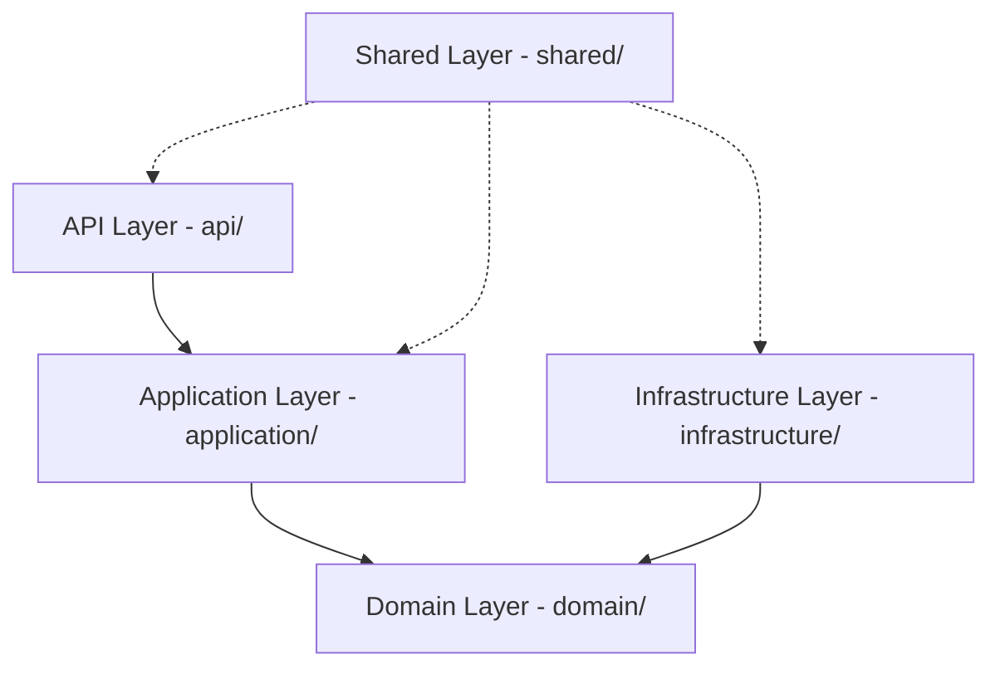
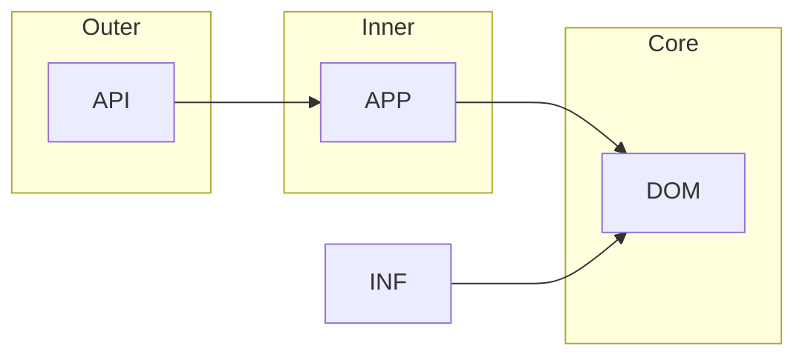
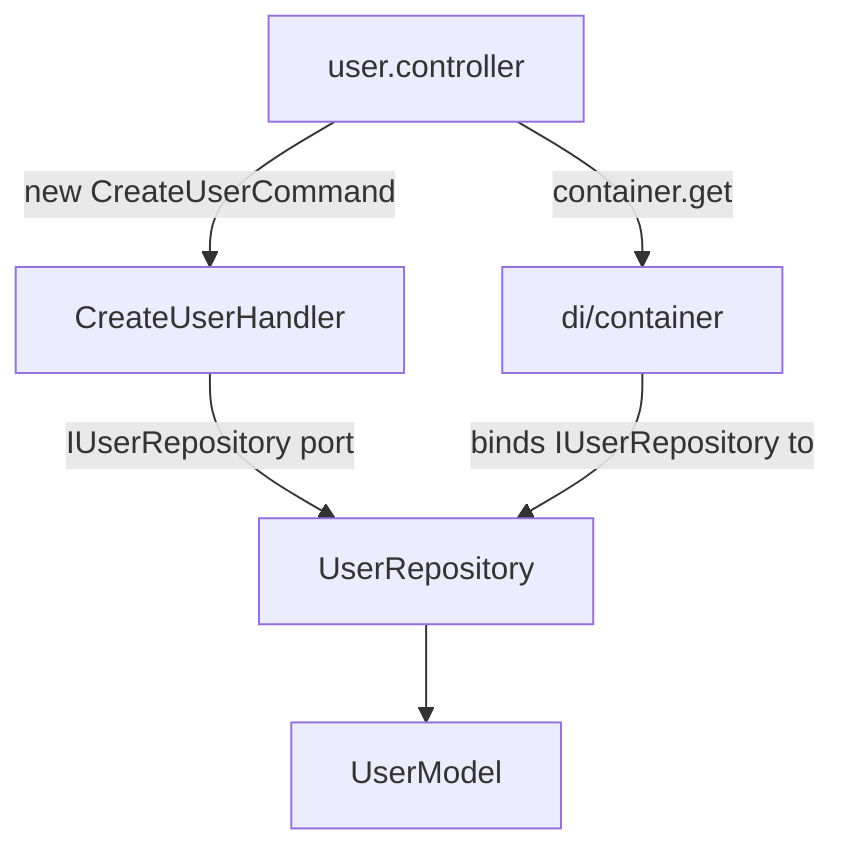
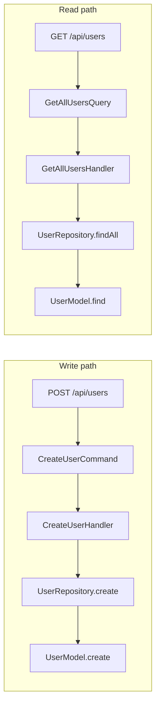
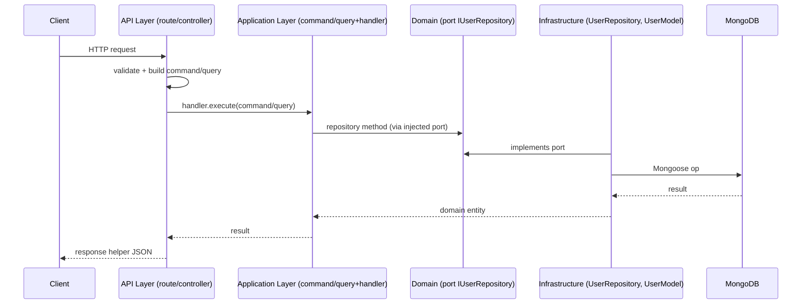

# Architecture — Clean Architecture + CQRS

This document explains the architectural layers, their responsibilities, and the **dependency rules**
that keep the codebase maintainable.

---

## 1. The Four (+ one) Layers



| Layer | Path | Role |
| --- | --- | --- |
| **API** | `src/api/` | HTTP boundary. Routes + controllers. Knows Express. |
| **Application** | `src/application/` | Use cases. Commands, queries, handlers, DTOs. Knows neither Express nor Mongoose. |
| **Domain** | `src/domain/` | Pure business rules. Entities, value objects, ports (interfaces). No frameworks. |
| **Infrastructure** | `src/infrastructure/` | Adapters. Mongoose, repositories, DI. Implements domain ports. |
| **Shared** | `src/shared/` | Cross-cutting concerns used by any layer (errors, logging, validation, response helpers). |

---

## 2. Layer-by-Layer Detail

### 2.1 API Layer (`api/`)

- **Responsibilities:** map URLs to routes, parse + validate the request at the HTTP edge, translate
  the request into a CQRS command/query, invoke a handler, and send a formatted response.
- **Knows:** Express, shared response helpers, DI container.
- **Knows nothing about:** MongoDB / Mongoose, business rules.

Files: `routes/` (index, user.routes), `controllers/` (user.controller).

### 2.2 Application Layer (`application/`)

- **Responsibilities:** define use cases. `commands/` and `queries/` are plain data objects; `handlers/`
  contain the orchestration/business logic; `dto/` hold Zod validation schemas + inferred types.
- **Depends only on:** Domain (ports, entities, value objects) and Shared (errors, DI tokens).
- **Knows nothing about:** Express, HTTP, MongoDB.

### 2.3 Domain Layer (`domain/`)

- **Responsibilities:** the business core — `entities/` (User, BaseEntity), `value-objects/` (UserRole),
  `interfaces/` (CQRS contracts), `repositories/` (the `IUserRepository` **port**).
- **Has zero dependencies** on frameworks/DB/Express. This is what makes it testable and swappable.

### 2.4 Infrastructure Layer (`infrastructure/`)

- **Responsibilities:** implement the domain ports. `database/mongoose` (connection), `database/models`
  (Mongoose schemas/models), `database/seed`, `repositories/` (the concrete `UserRepository` adapter),
  `di/` (InversifyJS container that wires everything).
- **Depends on:** Domain (to implement `IUserRepository`).
- **Note:** Infrastructure may import Shared (e.g. logger, DI tokens, errors).

### 2.5 Shared Layer (`shared/`)

- **Responsibilities:** cross-cutting utilities shared across layers — `errors/` (AppError hierarchy),
  `middleware/` (errorHandler, notFoundHandler, validate, authenticate/authorize, requestLogger),
  `types/` (response + pagination types), `utils/` (logger, response, asyncHandler), `constants/` (DI tokens).
- **Should not** depend on Application/Domain/Infrastructure internals. It is a leaf/utility layer.

---

## 3. The Dependency Rule (allowed dependencies)

> Dependencies always point **inward** toward the Domain. Inner layers never depend on outer layers.



**Allowed:**
- `api → application` (controllers build commands/queries and call handlers).
- `api/infrastructure/application → domain` (interfaces, entities, value objects).
- `infrastructure → domain` (repository adapter implements the domain port).
- `infrastructure → application` (container binds application handlers).
- `api → infrastructure` (controllers resolve handlers from the DI container).
- any layer → `shared` (utilities).

**In practice, for the `User` feature:**



---

## 4. Forbidden Dependencies

| Forbidden | Why |
| --- | --- |
| `domain` imports `infrastructure`, `application`, `api`, `mongoose`, `express` | Domain must stay pure; this would break testability and swap-ability. |
| `application` imports `api`, `express`, `mongoose` | Application must not know HTTP or DB details. |
| `infrastructure` imports `api` | Adapters must not depend on the HTTP boundary. |
| `shared` imports `domain`/`application`/`infrastructure` internals | Shared is a leaf utility layer. |

**Consequences if violated:** coupling, hard-to-test code, and inability to swap the database or add
alternative frameworks without touching business logic.

---

## 5. How CQRS Fits In

CQRS splits reads and writes:



- **Commands** (`application/commands/`) → **write** side. Mutate data.
- **Queries** (`application/queries/`) → **read** side. Only read data, no side effects.
- **Handlers** (`application/handlers/`) execute both, but a handler is never both a command handler and
  a query handler in a way that lets reads mutate or writes return query results.

---

## 6. Dependency Injection (InversifyJS)

The DI container (`src/infrastructure/di/container.ts`) binds the domain **port** to the concrete
**adapter** and binds every handler:

| Token (`TYPES`) | Bound to |
| --- | --- |
| `UserRepository` | `UserRepository` (Mongoose adapter) — singleton |
| `CreateUserHandler` | `CreateUserHandler` |
| `UpdateUserHandler` | `UpdateUserHandler` |
| `DeleteUserHandler` | `DeleteUserHandler` |
| `GetUserByIdHandler` | `GetUserByIdHandler` |
| `GetAllUsersHandler` | `GetAllUsersHandler` |

Handlers register their dependency in the constructor:

```ts
constructor(@inject(TYPES.UserRepository) private userRepository: IUserRepository) {}
```

Controllers obtain handlers lazily:

```ts
const createUserHandler = () => container.get<CreateUserHandler>(TYPES.CreateUserHandler);
```

This means the controller never constructs a repository or decides the DB — it just asks the container.

---

## 7. Request → Response (full architecture view)



---

## 8. Why This Structure Works

- **Testability:** Domain + Application have no IO, so they're trivially unit-testable with a fake repository.
- **Database swap:** replace `UserRepository` (Mongoose) with a new adapter + rebind the DI token; Domain/Application unchanged.
- **Clear contracts:** the `IUserRepository` port is the seam between the core and the infrastructure.

---

## Related Documents

- [00 - Project Startup Flow](00-project-startup-flow.md)
- [01 - Request Flow](01-request-flow.md)
- [Folders](folders/) — [api](folders/api.md), [application](folders/application.md), [domain](folders/domain.md), [infrastructure](folders/infrastructure.md), [shared](folders/shared.md)
- [CQRS](cqrs/)
- [Frontend Developer Guide](frontend-developer-guide.md)
