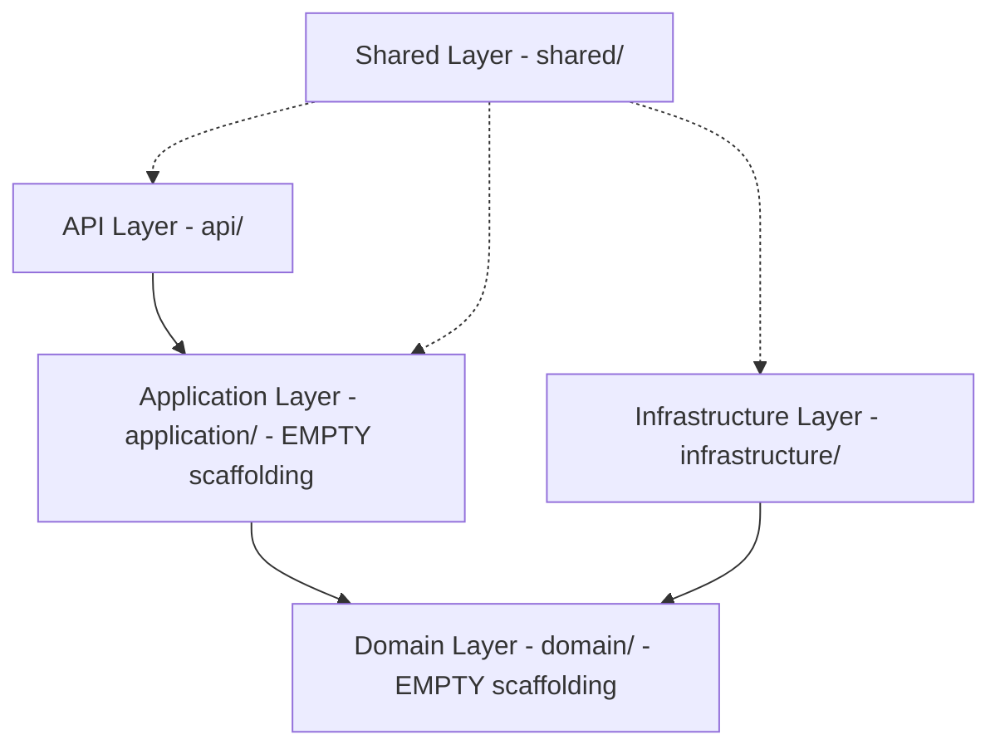
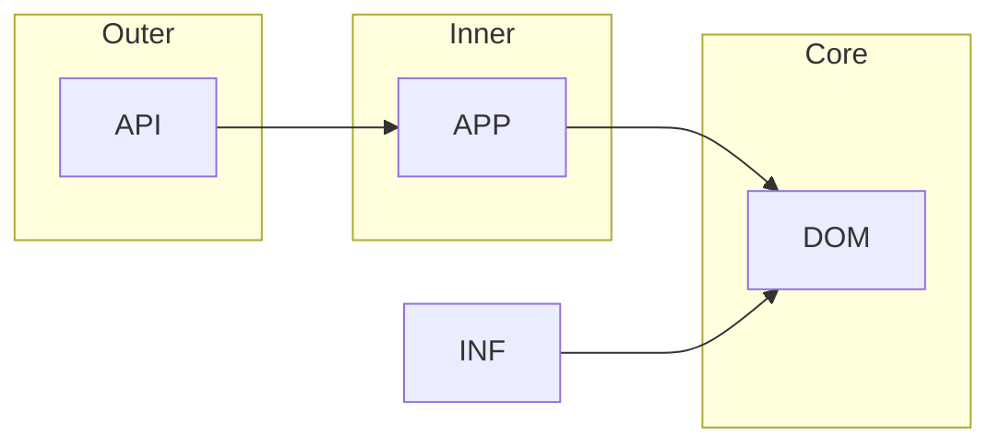
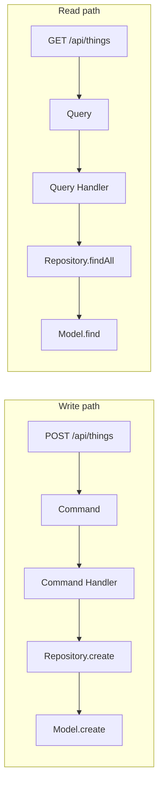
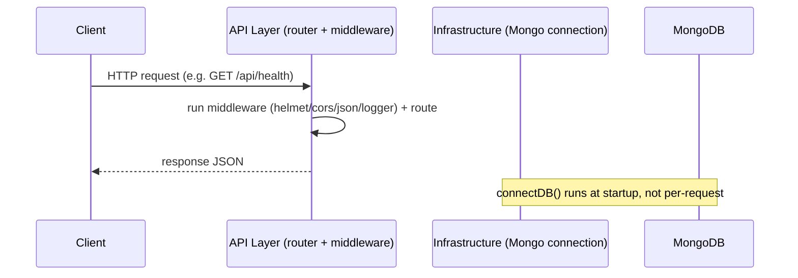

# Architecture — Clean Architecture + Planned CQRS (Plain JavaScript)

This document explains the architectural layers, their responsibilities, and the **dependency rules**
that keep the codebase maintainable. The project is **plain JavaScript** (CommonJS) — no TypeScript,
no build step, no DI framework.

---

## 1. The Five Layers

| Layer | Path | Role | Status |
| --- | --- | --- | --- |
| **API** | `src/api/` | HTTP boundary. Routes + middlewares. Knows Express. | Implemented (routes + middlewares) |
| **Application** | `src/application/` | Use cases: commands, queries, handlers, DTOs. | **Empty scaffolding** (future CQRS) |
| **Domain** | `src/domain/` | Pure business rules; entities, value objects, ports. | **Empty scaffolding** (future) |
| **Infrastructure** | `src/infrastructure/` | Adapters: Mongoose connection, models, repos. | Connection implemented; rest empty |
| **Shared** | `src/shared/` | Cross-cutting concerns: errors, logging, utils, constants. | Implemented |

---

## 2. Layer-by-Layer Detail

### 2.1 API Layer (`api/`)

- **Responsibilities:** map URLs to routes, run middleware at the HTTP edge, and format responses.
  Express routes live in `routes/`; reusable HTTP machinery in `middlewares/`.
- **Knows:** Express, Shared (asyncHandler, errors).
- **Knows nothing about:** MongoDB / Mongoose or business rules right now.
- Files: `routes/` (`index.js`, `health.routes.js`), `middlewares/` (`error-handler.js`,
  `request-logger.js`, `validate.js`). `controllers/` and `docs/` are empty placeholders.

### 2.2 Application Layer (`application/`)

- **Responsibilities (planned):** define use cases. `commands/` and `queries/` will be plain data
  objects; `handlers/` will contain orchestration/business logic; `dto/` will hold Zod validation
  schemas; `services/` will hold shared application services.
- **Depends only on:** Domain and Shared (errors).
- **Status:** All five sub-folders exist but contain only `.gitkeep` — **nothing is implemented yet**
  in Story 0.2.

### 2.3 Domain Layer (`domain/`)

- **Responsibilities (planned):** the business core — `entities/`, `repositories/` (ports),
  `value-objects/`.
- **Has zero dependencies** on frameworks/DB/Express — that is what makes it testable and swappable.
- **Status:** Empty scaffolding (`.gitkeep` only).

### 2.4 Infrastructure Layer (`infrastructure/`)

- **Responsibilities:** adapters that speak to the outside world. `database/mongoose/connection.js`
  provides `connectDB()`/`disconnectDB()`; `database/models/` and `repositories/` are empty
  placeholders where future Mongoose models and repository adapters will live; `config/` is an empty
  placeholder.
- **Depends on:** Domain (to implement future ports) and Shared (logger).
- **Note:** No DI container. Wiring is done by explicit `require(...)` imports.

### 2.5 Shared Layer (`shared/`)

- **Responsibilities:** cross-cutting utilities — `errors/` (`AppError` + error classes),
  `utils/` (logger, response helpers, asyncHandler), `constants/` (error codes).
- **Should not** depend on Application/Domain/Infrastructure internals. It is a leaf/utility layer.

---

## 3. The Dependency Rule (allowed dependencies)

> Dependencies always point **inward** toward the Domain. Inner layers never depend on outer layers.

**Allowed:**
- `api → application` (controllers build commands/queries and call handlers) — *future*.
- `api/application/infrastructure → domain` (interfaces, entities, value objects) — *future*.
- `infrastructure → domain` (repository adapter implements the domain port) — *future*.
- any layer → `shared` (utilities) — **current**.
- `api → infrastructure` (for Mongoose connection via imports, e.g. server.js) — **current**.

There is **no DI container**; dependencies are wired by direct imports.

---

## 4. Forbidden Dependencies

| Forbidden | Why |
| --- | --- |
| `domain` imports `infrastructure`, `application`, `api`, `mongoose`, `express` | Domain must stay pure; this would break testability and swap-ability. |
| `application` imports `api`, `express`, `mongoose` | Application must not know HTTP or DB details. |
| `infrastructure` imports `api` | Adapters must not depend on the HTTP boundary. |
| `shared` imports `domain`/`application`/`infrastructure` internals | Shared is a leaf utility layer. |

---

## 5. How CQRS Will Fit In (planned)

Story 0.2 ships no business logic. When future stories add CQRS:

- **Commands** (`application/commands/`) → **write** side. Mutate data.
- **Queries** (`application/queries/`) → **read** side. Only read data.
- **Handlers** (`application/handlers/`) execute both. Reads never mutate, writes never return query results.

The scaffolding folders already exist so future stories can drop in plain-JS factory/class modules.

---

## 6. Request → Response (current architecture view)

---

## 7. Why This Structure Works

- **Testability:** the eventual Domain + Application will have no IO, so they'll be trivially
  unit-testable with a fake repository.
- **Database swap:** replace a repository adapter (Mongoose) with another adapter; Domain/Application unchanged.
- **Simplicity:** plain JavaScript + explicit imports means no magic, no decorators, easy to debug —
  which suits a frontend-first, simple-and-maintainable objective.

---

## Related Documents

- [00 - Project Startup Flow](00-project-startup-flow.md)
- [01 - Request Flow](01-request-flow.md)
- [Folders](folders/) — [api](folders/api.md), [application](folders/application.md), [domain](folders/domain.md), [infrastructure](folders/infrastructure.md), [shared](folders/shared.md)
- [CQRS](cqrs/)
- [Frontend Developer Guide](frontend-developer-guide.md)
