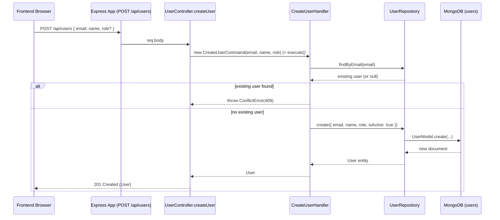

# Command: CreateUserCommand

## File Path

`src/application/commands/create-user.command.ts`

## Purpose

Represents the intent to **create a new user** in the system. It is a plain Data Transfer Object (DTO) that captures the user-supplied input for creating a user. It carries **no business logic** — it only describes *what* the caller wants to do.

## Properties

Constructor parameters (all `public readonly`):

| Parameter | Type          | Required | Description                                                                |
| --------- | ------------- | -------- | -------------------------------------------------------------------------- |
| `email`   | `string`      | Yes      | The email address of the new user. Stored lowercased in the database.      |
| `name`    | `string`      | Yes      | The display/full name of the new user.                                     |
| `role`    | `UserRole?`   | No       | The role to assign. Enum: `ADMIN`, `MANAGER`, `STAFF`. Defaults to `STAFF`. |

`UserRole` is an enum defined in `src/domain/value-objects/user-role.ts`:

```ts
export enum UserRole {
  ADMIN = 'ADMIN',
  MANAGER = 'MANAGER',
  STAFF = 'STAFF',
}
```

## Called By

- `user.controller.ts` → `createUser` (HTTP `POST /api/users`). See `src/api/controllers/user.controller.ts:107`.

```ts
const user = await createUserHandler().execute(
  new CreateUserCommand(data.email, data.name, data.role)
);
```

## Handled By

- `CreateUserHandler` (`src/application/handlers/create-user.handler.ts`)

## Flow



## Example

```ts
import { CreateUserCommand } from '../../../application/commands/create-user.command';
import { UserRole } from '../../../domain/value-objects/user-role';

const command = new CreateUserCommand('jane@example.com', 'Jane Doe', UserRole.MANAGER);
// role omitted -> defaults to STAFF in the handler
const commandDefault = new CreateUserCommand('bob@example.com', 'Bob');
```
