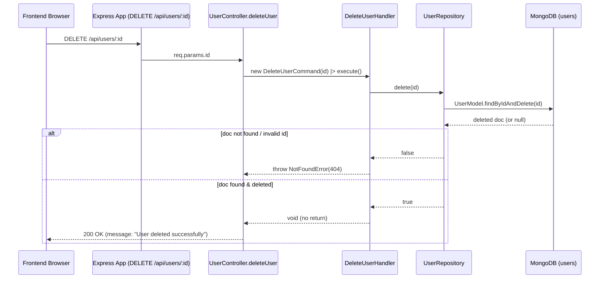

# Command: DeleteUserCommand

## File Path

`src/application/commands/delete-user.command.ts`

## Purpose

Represents the intent to **permanently remove an existing user**. It is a plain DTO that carries only the identifier of the user to delete. It carries **no business logic** — it only names *which* user should be removed.

## Properties

Constructor parameters (all `public readonly`):

| Parameter | Type      | Required | Description                                        |
| --------- | --------- | -------- | -------------------------------------------------- |
| `id`      | `string`  | Yes      | The MongoDB ObjectId (as string) of the user to delete. |

## Called By

- `user.controller.ts` → `deleteUser` (HTTP `DELETE /api/users/:id`). See `src/api/controllers/user.controller.ts:160`.

```ts
await deleteUserHandler().execute(new DeleteUserCommand(id));
```

## Handled By

- `DeleteUserHandler` (`src/application/handlers/delete-user.handler.ts`)

## Flow



## Example

```ts
import { DeleteUserCommand } from '../../../application/commands/delete-user.command';

const command = new DeleteUserCommand('645f...');
await deleteUserHandler().execute(command);
// On success: no return value. On missing user: NotFoundError is thrown (404).
```
