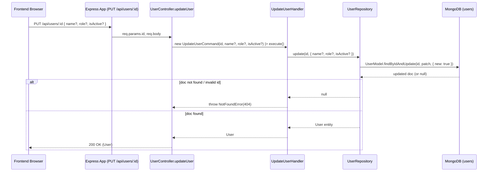

# Command: UpdateUserCommand

## File Path

`src/application/commands/update-user.command.ts`

## Purpose

Represents the intent to **modify an existing user**. It is a plain DTO that captures the user's `id` plus any subset of fields to update. It carries **no business logic** — only the data describing the change. All fields other than `id` are optional so partial updates are possible.

## Properties

Constructor parameters (all `public readonly`):

| Parameter    | Type          | Required | Description                                                                    |
| ------------ | ------------- | -------- | ------------------------------------------------------------------------------ |
| `id`         | `string`      | Yes      | The MongoDB ObjectId (as string) of the user to update.                        |
| `name`       | `string?`     | No       | New display name. If `undefined`, the field is left unchanged.                 |
| `role`       | `UserRole?`   | No       | New role (`ADMIN`, `MANAGER`, `STAFF`). If `undefined`, status is unchanged.   |
| `isActive`   | `boolean?`    | No       | New active status. If `undefined`, status is unchanged.                        |

> Only the fields explicitly passed as `undefined`-free values are patched. An omitted (or `undefined`) field is **not** written to the database.

## Called By

- `user.controller.ts` → `updateUser` (HTTP `PUT /api/users/:id`). See `src/api/controllers/user.controller.ts:133`.

```ts
const user = await updateUserHandler().execute(
  new UpdateUserCommand(id, data.name, data.role, data.isActive)
);
```

## Handled By

- `UpdateUserHandler` (`src/application/handlers/update-user.handler.ts`)

## Flow



## Example

```ts
import { UpdateUserCommand } from '../../../application/commands/update-user.command';
import { UserRole } from '../../../domain/value-objects/user-role';

// Update just the role
const cmd1 = new UpdateUserCommand('645f...', undefined, UserRole.ADMIN);
// Update name and deactivate
const cmd2 = new UpdateUserCommand('645f...', 'New Name', undefined, false);
```
