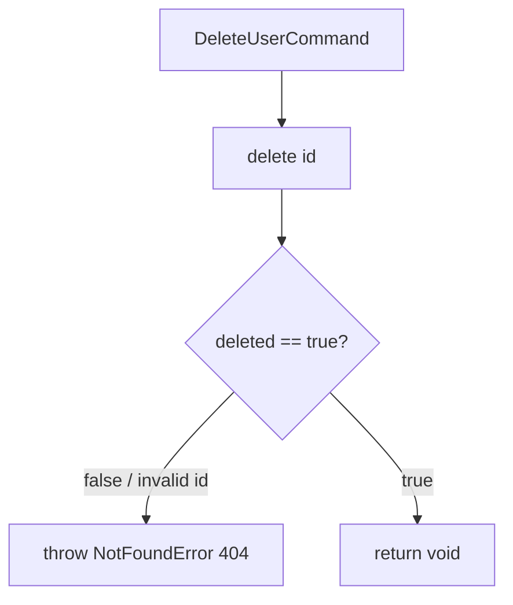

# Handler: DeleteUserHandler

## File Path

`src/application/handlers/delete-user.handler.ts`

## Purpose

The application-layer handler that owns the **business logic** for deleting a user. It takes a `DeleteUserCommand`, delegates the removal to the repository, and verifies the user existed.

## Input

`DeleteUserCommand` (`src/application/commands/delete-user.command.ts`):

- `id: string`

## Output

`Promise<void>` — no return value on success. Success is communicated by not throwing.

## Business Logic

1. Request deletion of the user by `id`.
2. Verify the deletion actually affected a document; if not, treat it as "not found".

## Repository Calls

- `userRepository.delete(id)` — physical removal. Returns `boolean` (`true` if a document was deleted, `false` if invalid id or no match).

Defined on `IUserRepository` (`src/domain/repositories/user-repository.interface.ts`).

## Error Handling

- Throws `NotFoundError('User')` when `delete` returns `false` (invalid ObjectId or no matching user). Surfaces as **HTTP 404 Not Found**.

## Flow Diagram



## Example

```ts
import { DeleteUserCommand } from '../commands/delete-user.command';

const cmd = new DeleteUserCommand('645f...');
await handler.execute(cmd); // resolves with void on success
```
