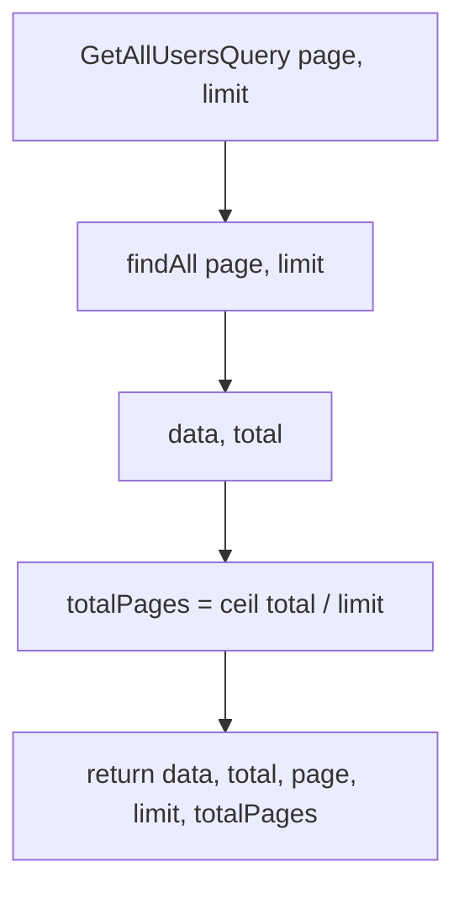

# Handler: GetAllUsersHandler

## File Path

`src/application/handlers/get-all-users.handler.ts`

## Purpose

The application-layer handler that fulfills a **read request** for a paginated list of users. It takes a `GetAllUsersQuery`, fetches a page of users plus a total count, and computes pagination metadata — all read-only, with no side effects.

## Input

`GetAllUsersQuery` (`src/application/queries/get-all-users.query.ts`):

- `page: number` (default `1`)
- `limit: number` (default `20`)

## Output

`Promise<FindAllResult & { page: number; limit: number; totalPages: number }>`

```ts
{
  data: User[];        // the page of users
  total: number;       // total number of users in the collection
  page: number;        // current page number
  limit: number;       // page size
  totalPages: number;  // computed: Math.ceil(total / limit)
}
```

`FindAllResult` is defined in `src/domain/repositories/user-repository.interface.ts`.

## Business Logic

1. Fetch the page of users and the overall total count from the repository.
2. Compute `totalPages = Math.ceil(total / limit)`.
3. Return data plus pagination metadata for the API layer.

## Repository Calls

- `userRepository.findAll(page, limit)` — returns `{ data, total }`.

Defined on `IUserRepository` (`src/domain/repositories/user-repository.interface.ts`).

## Error Handling

- No custom error handling. A lookup cannot "fail" in the not-found sense: an empty collection returns an empty `data` array with `total = 0` and `totalPages = 0`.

## Flow Diagram



## Example

```ts
import { GetAllUsersQuery } from '../queries/get-all-users.query';

const query = new GetAllUsersQuery(1, 5);
const result = await handler.execute(query);
// result.totalPages === Math.ceil(result.total / 5)
```
