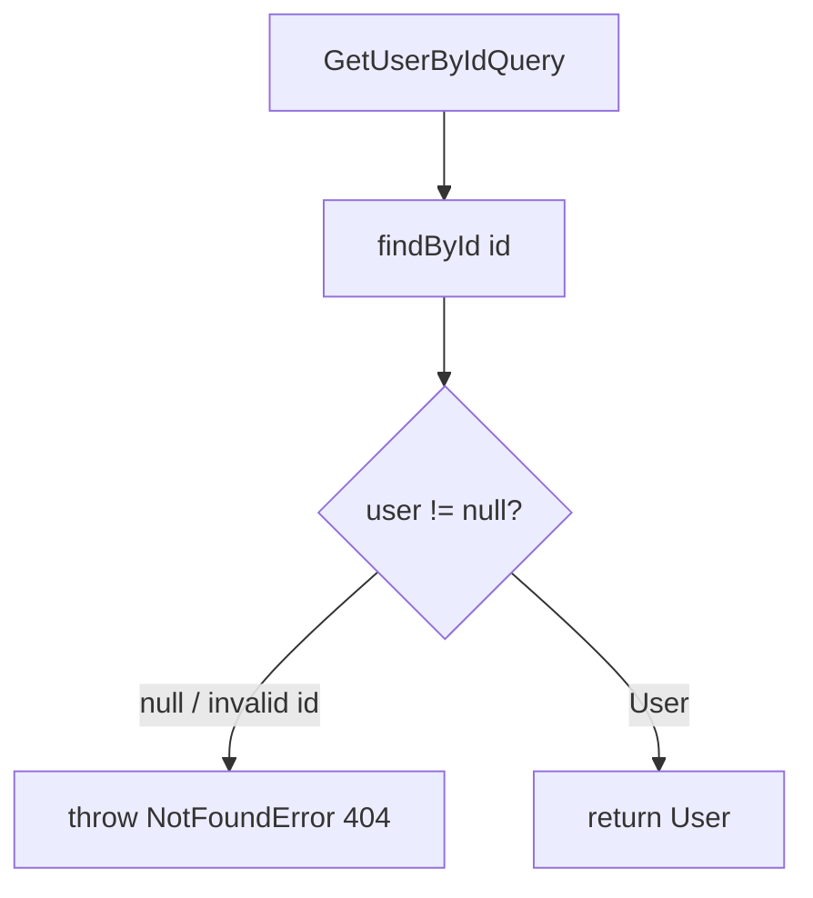

# Handler: GetUserByIdHandler

## File Path

`src/application/handlers/get-user-by-id.handler.ts`

## Purpose

The application-layer handler that fulfills a **read request**. It takes a `GetUserByIdQuery`, fetches a single user by id from the repository, and returns it — with no side effects on the database.

## Input

`GetUserByIdQuery` (`src/application/queries/get-user-by-id.query.ts`):

- `id: string`

## Output

`Promise<User>` — the matching user entity (`id`, `email`, `name`, `role`, `isActive`, `createdAt`, `updatedAt`).

## Business Logic

1. Look up the user by `id`.
2. If no user is found, treat the request as "not found".

## Repository Calls

- `userRepository.findById(id)` — read-only lookup. Returns `User | null`.

Defined on `IUserRepository` (`src/domain/repositories/user-repository.interface.ts`). `null` is returned for an invalid ObjectId or a missing document.

## Error Handling

- Throws `NotFoundError('User')` when `findById` returns `null` (invalid ObjectId or no matching user). Surfaces as **HTTP 404 Not Found**.

## Flow Diagram



## Example

```ts
import { GetUserByIdQuery } from '../queries/get-user-by-id.query';

const query = new GetUserByIdQuery('645f...');
const user = await handler.execute(query);
// user.email, user.name, user.role, user.isActive
```
