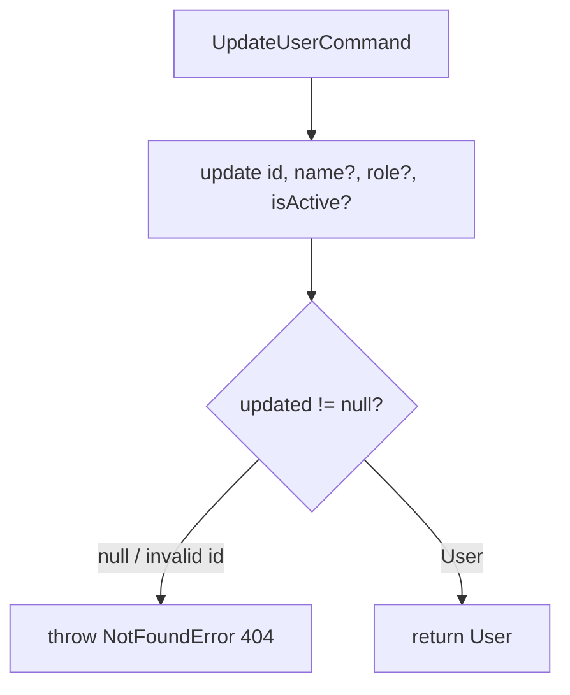

# Handler: UpdateUserHandler

## File Path

`src/application/handlers/update-user.handler.ts`

## Purpose

The application-layer handler that owns the **business logic** for updating an existing user. It takes an `UpdateUserCommand`, delegates the partial update to the repository, and returns the updated `User`.

## Input

`UpdateUserCommand` (`src/application/commands/update-user.command.ts`):

- `id: string`
- `name?: string`
- `role?: UserRole`
- `isActive?: boolean`

## Output

`Promise<User>` — the updated user entity (`id`, `email`, `name`, `role`, `isActive`, `createdAt`, `updatedAt`).

## Business Logic

1. Passthrough of the partial fields (`name`, `role`, `isActive`) to the repository — only `undefined`-free fields are patched.
2. Verify the update actually matched a document; if not, treat it as "not found".

## Repository Calls

- `userRepository.update(id, { name, role, isActive })` — partial persistence.

Defined on `IUserRepository` (`src/domain/repositories/user-repository.interface.ts`). The repository returns `User | null`; `null` means the id was invalid or no document matched.

## Error Handling

- Throws `NotFoundError('User')` when `update` returns `null` (invalid ObjectId or no matching user). Surfaces as **HTTP 404 Not Found**.

## Flow Diagram



## Example

```ts
import { UpdateUserCommand } from '../commands/update-user.command';
import { UserRole } from '../../domain/value-objects/user-role';

const cmd = new UpdateUserCommand('645f...', undefined, UserRole.MANAGER);
const user = await handler.execute(cmd);
// user.role === 'MANAGER' (name untouched)
```
