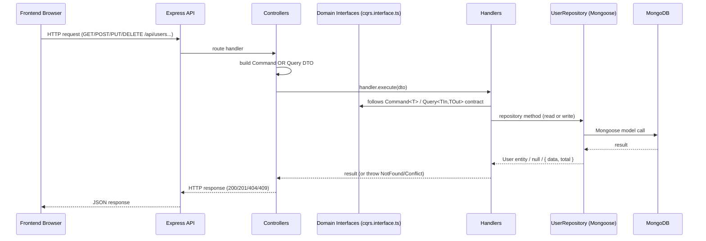

# CQRS in backend-twk-admin

This project implements **CQRS** (Command Query Responsibility Segregation) on top of **Clean Architecture**, using TypeScript, Express and Mongoose. This guide explains how CQRS is wired up, aimed at Frontend developers who may only see the HTTP side of things.

## What CQRS means here

CQRS separates the two kinds of operations a system performs:

- **Commands** — operations that **change** state (create, update, delete). They are verbs, e.g. "create a user".
- **Queries** — operations that **read** state without changing it (get one, list many). They are nouns, e.g. "the user by id".

Each of these is a *plain data object* (a DTO) that holds only the inputs. The actual **business logic** lives in a matching **Handler**. Handlers are the bridge between the HTTP layer (controllers) and the persistence layer (repositories), and ultimately MongoDB.

## Read/Write Separation

Even though commands and queries here currently touch the same `users` collection, the **code paths are fully separated**:

```
              ┌───────────────────────────────┐
              │   Express HTTP Controllers     │
              │   src/api/controllers/         │
              └───────────────┬───────────────┘
                              │
               ┌──────────────┴──────────────┐
               │                             │
      (WRITE)  ▼                             ▼  (READ)
   Commands DTOs                        Queries DTOs
   (create/update/delete)               (get by id, get all)
               │                             │
               ▼                             ▼
   Command Handlers                   Query Handlers
   (business logic)                  (business logic, read-only)
               │                             │
               └──────────────┬──────────────┘
                              ▼
                   IUserRepository (port)
                              │
                              ▼
                   UserRepository (adapter)
                              │
                              ▼
                        MongoDB (users)
```

- **Commands** are dispatched to **Command Handlers**.
- **Queries** are dispatched to **Query Handlers**.
- Both handler kinds use the **same repository port** (`IUserRepository`), but command handlers call methods that mutate (`create`, `update`, `delete`), while query handlers call read-only methods (`findById`, `findAll`).

## Mapping Table

| Command / Query | Handler | Repository Method | Mongoose Operation |
| --------------- | ------- | ----------------- | ------------------ |
| `CreateUserCommand` | `CreateUserHandler` | `findByEmail` → `create` | `findOne` → `create` |
| `UpdateUserCommand` | `UpdateUserHandler` | `update` | `findByIdAndUpdate` |
| `DeleteUserCommand` | `DeleteUserHandler` | `delete` | `findByIdAndDelete` |
| `GetUserByIdQuery` | `GetUserByIdHandler` | `findById` | `findById(...).lean()` |
| `GetAllUsersQuery` | `GetAllUsersHandler` | `findAll` (+ `count`) | `find(...).sort().skip().limit()` + `countDocuments()` |

### HTTP → CQRS mapping

| REST Endpoint | Method | Command / Query | Handler |
| ------------- | ------ | --------------- | ------- |
| `/api/users`           | GET    | `GetAllUsersQuery`  | `GetAllUsersHandler`  |
| `/api/users/:id`       | GET    | `GetUserByIdQuery`  | `GetUserByIdHandler`  |
| `/api/users`           | POST   | `CreateUserCommand` | `CreateUserHandler`  |
| `/api/users/:id`       | PUT    | `UpdateUserCommand` | `UpdateUserHandler`  |
| `/api/users/:id`       | DELETE | `DeleteUserCommand` | `DeleteUserHandler` |

## Full Flow (end to end)



## Domain contracts

The formal contracts are `Command<T, TResult>` and `Query<TInput, TOutput>` in `src/domain/interfaces/cqrs.interface.ts`. See the dedicated page [cqrs-interface.md](./cqrs-interface.md).

## Directory reference

- **Commands:** `src/application/commands/`
- **Queries:** `src/application/queries/`
- **Handlers:** `src/application/handlers/`
- **Domain contracts:** `src/domain/interfaces/cqrs.interface.ts`
- **Repository port:** `src/domain/repositories/user-repository.interface.ts`
- **Repository adapter:** `src/infrastructure/repositories/user.repository.ts`
- **Controllers:** `src/api/controllers/user.controller.ts`
- **DI/container:** resolved via `src/infrastructure/di` and `TYPES` tokens.
