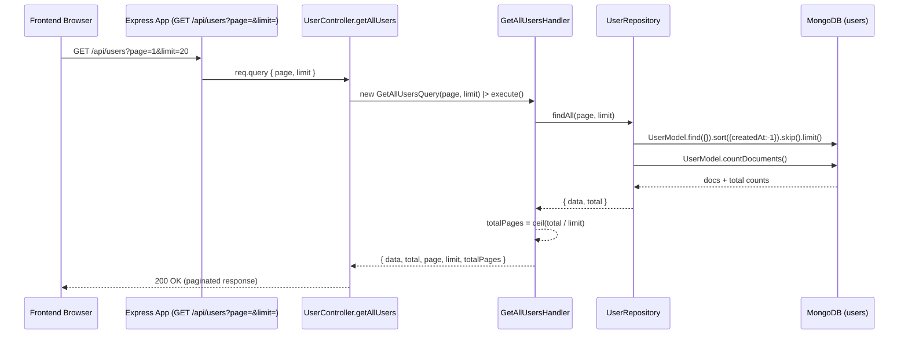

# Query: GetAllUsersQuery

## File Path

`src/application/queries/get-all-users.query.ts`

## Purpose

Represents a **read request** to fetch a paginated list of all users. It is a plain DTO that carries pagination parameters (`page`, `limit`). It carries **no business logic** and has **no side effects** — it only requests data that already exists.

> **Query vs Command:** A *Query* reads data without changing system state; a *Command* mutates it. `GetAllUsersQuery` is a read-only, paginated listing, so it is classified as a Query.

## Properties

Constructor parameters (all `public readonly`, both with defaults):

| Parameter | Type      | Required | Default | Description                                        |
| --------- | --------- | -------- | ------- | -------------------------------------------------- |
| `page`    | `number`  | No       | `1`     | The 1-based page number to fetch.                  |
| `limit`   | `number`  | No       | `20`    | The maximum number of records to return per page.  |

## Called By

- `user.controller.ts` → `getAllUsers` (HTTP `GET /api/users`). See `src/api/controllers/user.controller.ts:44`.

```ts
const result = await getAllUsersHandler().execute(new GetAllUsersQuery(page, limit));
```

## Handled By

- `GetAllUsersHandler` (`src/application/handlers/get-all-users.handler.ts`)

## Flow



## Example

```ts
import { GetAllUsersQuery } from '../../../application/queries/get-all-users.query';

const query = new GetAllUsersQuery(2, 10); // page 2, 10 per page
const result = await getAllUsersHandler().execute(query);
// {
//   data: User[],
//   total: number,
//   page: 2,
//   limit: 10,
//   totalPages: number,
// }
```
