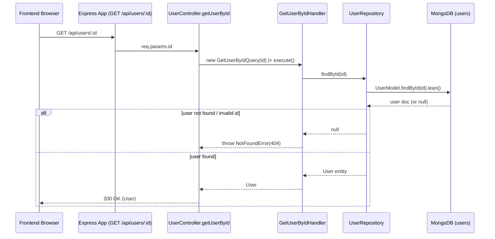

# Query: GetUserByIdQuery

## File Path

`src/application/queries/get-user-by-id.query.ts`

## Purpose

Represents a **read request** to fetch a single user by its identifier. It is a plain DTO that carries only the `id`. As with all queries, it carries **no business logic** and has **no side effects** — it never changes the state of the system.

> **Query vs Command:** A *Query* reads data and returns it without mutating anything. A *Command* changes the state of the system. `GetUserByIdQuery` is a read-only lookup, so it is classified as a Query.

## Properties

Constructor parameters (all `public readonly`):

| Parameter | Type      | Required | Description                                          |
| --------- | --------- | -------- | ---------------------------------------------------- |
| `id`      | `string`  | Yes      | The MongoDB ObjectId (as string) of the user to fetch. |

## Called By

- `user.controller.ts` → `getUserById` (HTTP `GET /api/users/:id`). See `src/api/controllers/user.controller.ts:73`.

```ts
const user = await getUserByIdHandler().execute(new GetUserByIdQuery(id));
```

## Handled By

- `GetUserByIdHandler` (`src/application/handlers/get-user-by-id.handler.ts`)

## Flow



## Example

```ts
import { GetUserByIdQuery } from '../../../application/queries/get-user-by-id.query';

const query = new GetUserByIdQuery('645f...');
const user = await getUserByIdHandler().execute(query);
// user.id, user.email, user.name, user.role, user.isActive
```
