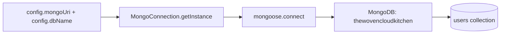
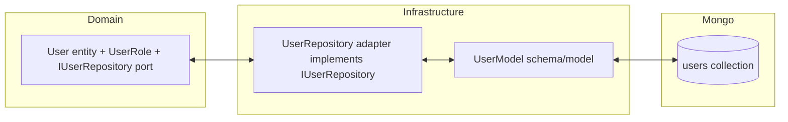
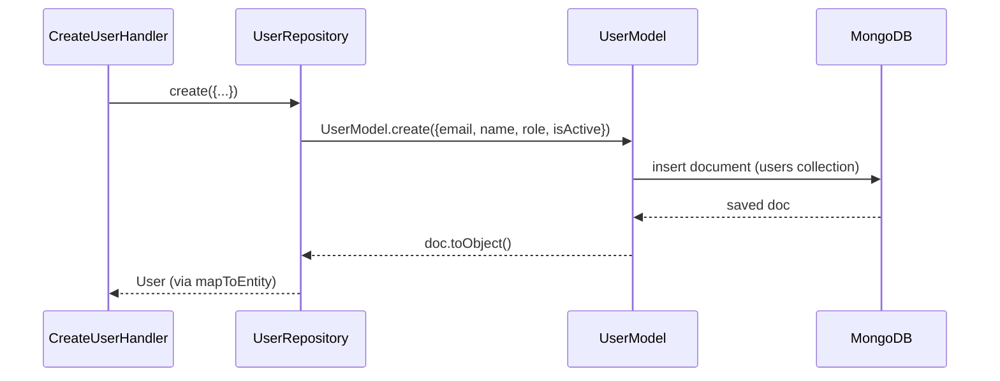
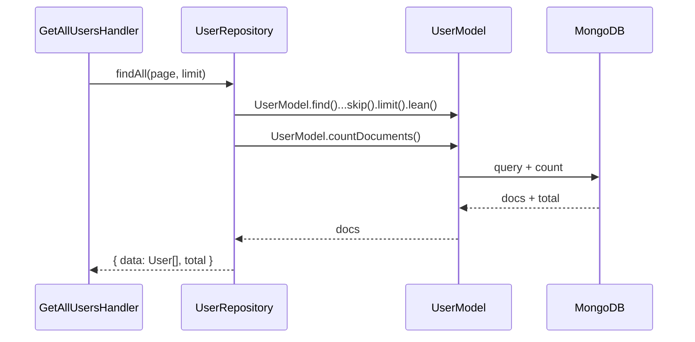
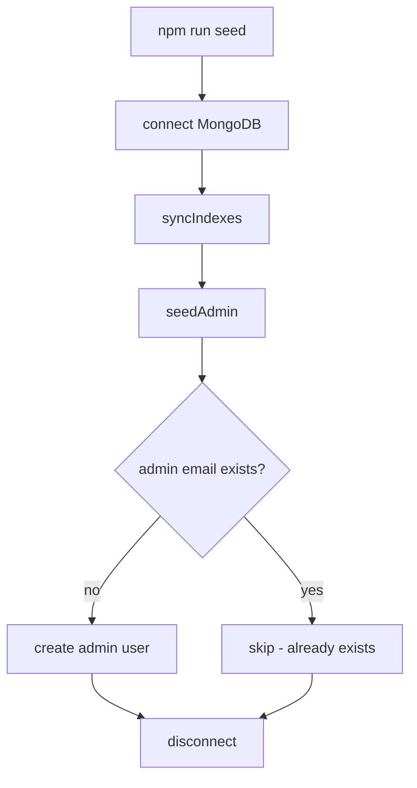

# Database — MongoDB / Mongoose

This document explains the MongoDB database configuration, collections, schemas, indexes, models,
and how the database maps back to the application's domain entities.

---

## 1. Overview

| Item | Value |
| --- | --- |
| Engine | MongoDB |
| ODM | Mongoose |
| Database name | `thewovencloudkitchen` |
| Default URI | `mongodb://localhost:27017` |
| Connection env vars | `MONGODB_URI`, `DB_NAME` |
| Connection code | `src/infrastructure/database/mongoose/connection.ts` |
| Collection | `users` |



---

## 2. Connection

`MongoConnection` (singleton) in `src/infrastructure/database/mongoose/connection.ts`:

- `connect()` — calls `mongoose.connect(uri, { dbName, autoIndex })`.
  - `autoIndex` is **false in production**, **true otherwise** (so indexes aren't rebuilt in prod).
- Listens to Mongoose connection events and logs them (`connected`, `error`, `disconnected`).
- `disconnect()` — calls `mongoose.disconnect()`.

The connection is established in `src/server.ts` bootstrap **before** the HTTP server listens. If it
fails, the process exits.

See also: [`docs/files/infrastructure/database/mongoose/connection.md`](files/infrastructure/database/mongoose/connection.md)

---

## 3. Database Name

`DB_NAME=thewovencloudkitchen`. This is passed as the `dbName` option to `mongoose.connect`, so all
collections live inside the `thewovencloudkitchen` database.

---

## 4. Collections, Schemas & Indexes

### `users` collection — defined in `src/infrastructure/database/models/user.model.ts`

Mongoose **schema** (`userSchema`):

| Field | Type | Required | Default | Notes |
| --- | --- | --- | --- | --- |
| `email` | String | ✅ | — | `trim`, `lowercase`, **unique** |
| `name` | String | ✅ | — | `trim` |
| `role` | String (enum) | — | `STAFF` | enum: `ADMIN` \| `MANAGER` \| `STAFF` |
| `isActive` | Boolean | — | `true` | — |
| `createdAt` | Date | — | auto | from `timestamps: true` |
| `updatedAt` | Date | — | auto | from `timestamps: true` |
| `_id` | ObjectId | — | auto | primary key (hidden from domain) |
| `__v` | Number | — | auto | Mongoose version key |

Schema options:
- `timestamps: true` → Mongoose manages `createdAt` / `updatedAt`.
- `collection: 'users'` → explicit collection name.

**Indexes:**

```ts
userSchema.index({ email: 1 }, { unique: true });   // unique email
userSchema.index({ role: 1, isActive: 1 });          // compound for role+active queries
```

| Index | Fields | Unique | Purpose |
| --- | --- | --- | --- |
| email | `email` (asc) | ✅ | enforce unique emails; fast by-email lookup |
| role+isActive | `role`, `isActive` | ❌ | fast filtered listing by role + active flag |

> The `email` field also has `index: true` on its SchemaType; the explicit unique index guarantees
> uniqueness. Indexes are synchronized at seed time via `UserModel.syncIndexes()`.

**Model:** `UserModel = model<UserDocument>('User', userSchema)`.

---

## 5. Relationship Between Layers

There is **one entity** (`User`) and **one collection** (`users`). No embedded/related collections
yet. MongoDB is used as a document store; the CQRS read/write separation still goes through the same
collection for `User`.



---

## 6. Model ↔ Entity ↔ Repository Mapping

The **domain entity** (`src/domain/entities/user.entity.ts`):

```ts
interface User extends BaseEntity {
  email: string;
  name: string;
  role: UserRole;
  isActive: boolean;
}
```

The **repository** (`src/infrastructure/repositories/user.repository.ts`) adapts between Mongoose
documents and domain entities via a private `mapToEntity()`:

| Domain `User` field | Mongoose document source | Notes |
| --- | --- | --- |
| `id` | `doc._id` | ObjectId → `String(doc._id)` |
| `email` | `doc.email` | lowercased on write |
| `name` | `doc.name` | — |
| `role` | `doc.role` | cast to `UserRole` enum |
| `isActive` | `doc.isActive` | — |
| `createdAt` | `doc.createdAt` | fallback `new Date()` if absent |
| `updatedAt` | `doc.updatedAt` | fallback `new Date()` if absent |

`IUserRepository` (the port — `src/domain/repositories/user-repository.interface.ts`) declares:

| Method | Mongo operation (in adapter) | Returns |
| --- | --- | --- |
| `findById(id)` | `UserModel.findById(id).lean()` (guarded by ObjectId validity) | `User \| null` |
| `findByEmail(email)` | `UserModel.findOne({ email: lowercase }).lean()` | `User \| null` |
| `findAll(page, limit)` | `UserModel.find().sort({createdAt:-1}).skip().limit().lean()` + `countDocuments()` | `{ data, total }` |
| `create(data)` | `UserModel.create({...})` → `doc.toObject()` | `User` |
| `update(id, data)` | `UserModel.findByIdAndUpdate(id, patch, { new: true }).lean()` | `User \| null` |
| `delete(id)` | `UserModel.findByIdAndDelete(id)` (returns null if not found) | `boolean` |
| `count()` | `UserModel.countDocuments()` | `number` |

> All findById/update/delete operations first validate the id with `Types.ObjectId.isValid(id)`.
> An invalid id returns `null`/`false`, which the application layer turns into a `NotFoundError` (404).

---

## 7. Write Path (Mongo operation example)



---

## 8. Read Path (Mongo operation example)



---

## 9. Seed Data

Performed by the seeder (`src/infrastructure/database/seed/seeder.ts`) when you run `npm run seed`
(or the Docker `seed` service):

1. **`syncIndexes()`** — calls `UserModel.init()` then `UserModel.syncIndexes()` so the unique email
   index + compound index are created/updated.
2. **`seedAdmin(config)`** — checks if the admin email exists; if not, creates the first user with
   role `ADMIN`. Configurable via `SEED_ADMIN_EMAIL` / `SEED_ADMIN_NAME`.



---

## 10. Best Practices / Notes

- Keep the **domain entity** free of Mongoose types; only the infrastructure repository touches `Model`.
- `mapToEntity` is the single chokepoint converting DB docs → domain objects.
- Validate `ObjectId` before calling Mongoose `findById`/`findByIdAndUpdate` to avoid cast errors.
- In production, `autoIndex` is disabled; run `npm run seed` to sync indexes explicitly.

## Related Documents

- [File: user.model.md](files/infrastructure/database/models/user.model.md)
- [File: user.repository.md](files/infrastructure/repositories/user.repository.md)
- [File: connection.md](files/infrastructure/database/mongoose/connection.md)
- [File: seeder.md](files/infrastructure/database/seed/seeder.md)
- [Domain: user-repository.interface.md](files/domain/repositories/user-repository.interface.md)
