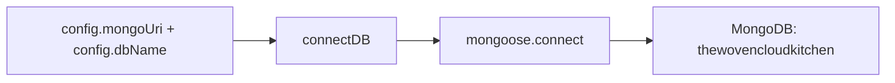
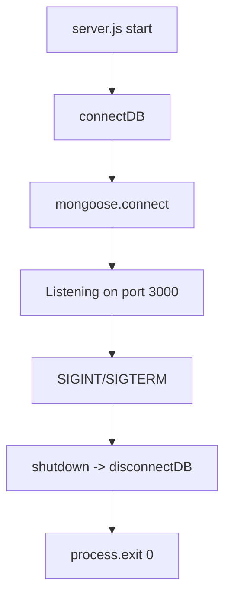

# Database — MongoDB / Mongoose (Connection)

This document explains the MongoDB configuration and the Mongoose connection for the backend. In the
current Story 0.2 setup there are **no business models or collections yet** — only the database
connection layer is implemented, ready to be used by future stories.

---

## 1. Overview

| Item | Value |
| --- | --- |
| Engine | MongoDB |
| ODM | Mongoose |
| Database name | `thewovencloudkitchen` |
| Default URI | `mongodb://localhost:27017/thewovencloudkitchen` |
| Connection env vars | `MONGODB_URI`, `DB_NAME` |
| Connection code | `src/infrastructure/database/mongoose/connection.js` |
| Collections | **none yet** (no models in Story 0.2) |

---

## 2. Connection

`connectDB()` in `src/infrastructure/database/mongoose/connection.js`:

- Calls `mongoose.set('strictQuery', true)` once (avoids a Mongoose deprecation warning).
- Calls `mongoose.connect(config.mongoUri, { dbName, autoIndex: !isProd })`.
  - `autoIndex` is **false in production**, **true otherwise** (so indexes aren't rebuilt in prod).
- Registers listeners on the Mongoose connection and logs events:
  - `connected` → `MongoDB connected to database: <dbName>`.
  - `error` → logs the error.
  - `disconnected` → logs a warning.
- `disconnectDB()` calls `mongoose.disconnect()`.

The connection is established in `src/server.js` bootstrap (`start()`) **before** the HTTP server
listens. If it fails, the process exits.

See also: [`docs/files/infrastructure/database/mongoose/connection.md`](files/infrastructure/database/mongoose/connection.md)

---

## 3. Database Name

`DB_NAME=thewovencloudkitchen`. This is passed as the `dbName` option to `mongoose.connect`, so all
collections live inside the `thewovencloudkitchen` database.

---

## 4. Collections, Schemas & Indexes

**None yet.** Story 0.2 intentionally introduces no business-specific models (per the story
restrictions: do not create models such as `User`). The `src/infrastructure/database/models/` folder
exists as empty scaffolding (`.gitkeep`) for future Mongoose schemas/models.

---

## 5. Connection Env Config

| env var | config property | default | purpose |
| --- | --- | --- | --- |
| `MONGODB_URI` | `config.mongoUri` | *(required)* | MongoDB connection string |
| `DB_NAME` | `config.dbName` | `thewovencloudkitchen` | MongoDB database name |

The config is validated by a Zod schema in `src/config/index.js`; a missing `MONGODB_URI` prevents
startup.

---

## 6. Lifecycle

- The DB is connected once at startup and disconnected once on graceful shutdown.
- MongoDB itself is provided locally (e.g. `docker compose up mongodb`, mongo:7) or by an external
  instance.

---

## 7. Best Practices / Notes

- Keep domain/business code free of Mongoose types; only the infrastructure layer touches Mongoose.
- Never read `process.env` directly for DB config — use the validated `config` object.
- `autoIndex: false` in production means indexes must be created explicitly (e.g. via migration/seed)
  when models are added in later stories.

## Related Documents

- [File: connection.md](files/infrastructure/database/mongoose/connection.md)
- [Folder: infrastructure.md](folders/infrastructure.md)
- [00 - Project Startup Flow](00-project-startup-flow.md)
