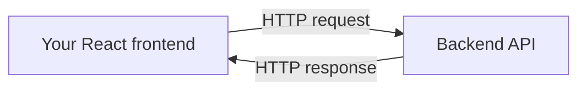
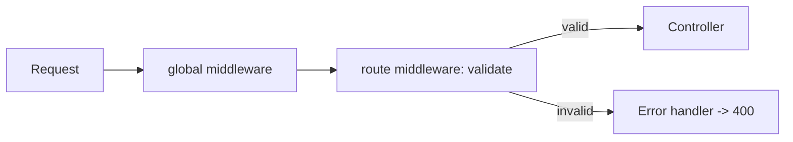
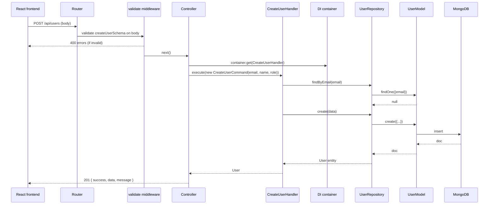

# Frontend Developer Guide

This guide teaches you the backend project as if you're a React developer who has never touched a
Node backend before. It uses plain language, analogies, and diagrams.

---

## 0. The Big Picture

Think of the backend as a **restaurant kitchen**. Your React app is the **customer**.



When the React app calls an API, it sends an HTTP request. The backend receives it, processes it,
and returns an HTTP response (JSON). Everything below is about how the kitchen turns a "request"
into a "response".

---

## 1. Where a Request Starts

From React you'd call:

```ts
// React (frontend)
const res = await fetch('/api/users', {
  method: 'POST',
  headers: { 'Content-Type': 'application/json' },
  body: JSON.stringify({ email: 'x@x.com', name: 'X', role: 'ADMIN' }),
});
```

That hits the backend's URL. The backend uses **Express** to listen for these requests.

---

## 2. How the Server Starts (quick version)

`npm run dev` → runs `src/server.ts` → connects to MongoDB → starts Express listening on port `3000`.

You don't need to change anything here. Just know: **if the database can't be reached, the server won't start.**

---

## 3. How Routing Works

Routes are like a **mail-room directory**: given a URL, they decide WHICH handler to send it to.

- `src/api/routes/index.ts` mounts feature routers: `router.use('/users', userRouter)`.
- `src/api/routes/user.routes.ts` defines the specific endpoints:

```ts
router.get('/',  validate(userQuerySchema, 'query'), getAllUsers);   // GET /api/users
router.post('/', validate(createUserSchema, 'body'), createUser);    // POST /api/users
router.get('/:id', validate(userIdParamsSchema, 'params'), getUserById); // GET /api/users/:id
```

Analogy: `/:id` is like a URL parameter `{ id: '123' }` — same as React Router's `useParams()`.

---

## 4. How Middleware Works

Middleware are **checkpoints** a request passes through. They can inspect, modify, or reject a request
before it reaches the controller.



In `src/app.ts`, global middleware runs on every request:

- `helmet()` — adds security headers.
- `cors()` — allows requests from other origins (your React dev server).
- `compression()` — gzips the response.
- `express.json()` — parses the JSON body into `req.body`.
- `requestLogger` — logs each request.

**Validation middleware** (`validate(schema, source)`) is what protects each route. It checks
`req.body`, `req.query`, or `req.params` against a **Zod** schema. If invalid, it sends a `400`
response immediately and the controller never runs.

---

## 5. How the Controller Works

The controller is a **translator**. It:
1. Reads data off `req` (body/query/params).
2. Builds a command/query object.
3. Asks the DI container for the right handler.
4. Calls `handler.execute(...)`.
5. Sends the response with a response helper.

```ts
export const createUser = asyncHandler(async (req, res) => {
  const data = req.body as CreateUserInput;
  const user = await createUserHandler().execute(
    new CreateUserCommand(data.email, data.name, data.role)
  );
  createdResponse(res, user, 'User created successfully');
});
```

`asyncHandler` is just a safety wrapper — it catches any thrown error and forwards it to the error
middleware, so the controller code stays clean.

---

## 6. Commands vs Queries (the write vs read split)

This is the **CQRS** pattern. It separates "things that change data" from "things that read data":

| Type | Folder | Example | Side effect |
| --- | --- | --- | --- |
| **Command** | `application/commands/` | `CreateUserCommand` | writes (mutates) |
| **Query** | `application/queries/` | `GetAllUsersQuery` | reads only |

A command is just a **bag of data**:

```ts
new CreateUserCommand("x@x.com", "X", "ADMIN")
// holds: email, name, role
```

A query is also a bag of data, e.g. `new GetAllUsersQuery(page, limit)`.

**Why?** Clear separation: you always know whether a piece of code reads or writes.

---

## 7. How the Handler Works

The handler is where the **business logic** lives. It takes a command/query and does the work.

```ts
async execute(command: CreateUserCommand): Promise<User> {
  const existing = await this.userRepository.findByEmail(command.email);
  if (existing) throw new ConflictError('User with this email already exists');
  return this.userRepository.create({ ... });
}
```

Think of the handler as the **cook** — it decides the recipe (check for duplicate email, then create).
The controller just hands the order to the cook.

---

## 8. How the Repository Works

The repository is the **bridge between application logic and the database**. It implements an
interface (the "port") so that the rest of the code doesn't care about MongoDB.

- **Port (contract):** `src/domain/repositories/user-repository.interface.ts` — declares
  `findById`, `findByEmail`, `findAll`, `create`, `update`, `delete`, `count`.
- **Adapter (implementation):** `src/infrastructure/repositories/user.repository.ts` — does the
  actual Mongoose calls.

The handler only knows the **port** (the interface). The DI container decides which concrete
implementation to inject. This means we could swap MongoDB for something else without touching
handlers.

---

## 9. How Mongoose Works

Mongoose is the tool that talks to MongoDB. It maps a **schema** to a **collection** (like a table).

`src/infrastructure/database/models/user.model.ts` defines the `UserModel`:

```ts
const userSchema = new Schema({ email: {...}, name: {...}, role: {...}, isActive: {...} }, { timestamps: true });
export const UserModel = model<UserDocument>('User', userSchema);
```

- Collection name: `users`.
- `timestamps: true` → Mongoose auto-adds `createdAt` and `updatedAt`.
- `email` has a **unique index** → MongoDB rejects a second document with the same email.

The repository uses the model, e.g.:

```ts
await UserModel.findById(id);
await UserModel.findOne({ email });
await UserModel.find({}).skip(0).limit(20);
await UserModel.create({ ... });
await UserModel.findByIdAndUpdate(id, patch, { new: true });
await UserModel.findByIdAndDelete(id);
await UserModel.countDocuments();
```

---

## 10. How the Response Helper Works

Instead of hand-writing response JSON every time, the code uses helpers in
`src/shared/utils/response.ts`:

| Helper | status | Response shape |
| --- | --- | --- |
| `successResponse(res, data, message)` | 200 | `{ success, data, message? }` |
| `createdResponse(res, data, message)` | 201 | `{ success, data, message }` |
| `noContentResponse(res)` | 204 | empty |
| `errorResponse(res, message, status, errors)` | custom | `{ success:false, message, errors? }` |
| `paginatedResponse(res, data, pagination)` | 200 | `{ success, data, pagination }` |

Example for a list:

```json
{
  "success": true,
  "data": [ { "id": "..", "email": "..", ... } ],
  "pagination": { "page": 1, "limit": 20, "total": 3, "totalPages": 1 }
}
```

---

## 11. How Error Handling Works

Errors are centralized. Two important pieces:

### 11.1 `AppError` hierarchy (`src/shared/errors/`)

| Error class | Status | `code` |
| --- | --- | --- |
| `ValidationError` | 400 | `VALIDATION_ERROR` |
| `UnauthorizedError` | 401 | `UNAUTHORIZED` |
| `ForbiddenError` | 403 | `FORBIDDEN` |
| `NotFoundError` | 404 | `NOT_FOUND` |
| `ConflictError` | 409 | `CONFLICT` |
| `InternalError` | 500 | `INTERNAL_ERROR` |

Handlers throw these (e.g. `throw new ConflictError(...)`), and the error middleware formats them
consistently.

### 11.2 Global error middleware (`src/shared/middleware/error-handler.middleware.ts`)

```mermaid
flowchart TD
    A[any thrown error] --> B[errorHandler]
    B --> C{is AppError?}
    C -->|yes| D[res.status(error.statusCode).json(error.toJSON())]
    C -->|no| E[500 generic error]
```

Error response shape (from `AppError.toJSON()`):

```json
{
  "status": "error",
  "message": "User with this email already exists",
  "code": "CONFLICT"
}
```

For `ValidationError`, an extra `errors` field lists per-field messages:

```json
{
  "status": "error",
  "message": "Validation failed",
  "code": "VALIDATION_ERROR",
  "errors": { "email": ["Invalid email format"] }
}
```

So in React you can rely on: `res.status === 'error'`, read `res.code` to handle categories, and read
`res.errors` for per-field validation messages.

---

## 12. Full Request → Response Walkthrough (POST /api/users)



---

## 13. Mapping to Your React Skills

| Backend concept | React / frontend analogy |
| --- | --- |
| Express route | React Router route (`path="/users"`) |
| `/:id` | React Router `useParams()` → `{ id }` |
| `req.body` | the payload you `JSON.stringify` in `fetch` |
| `req.query` | URL search params (React: `useSearchParams`) |
| Middleware | a `useEffect`-style guard or an axios interceptor |
| Controller | a component that bridges props → actions |
| Zimod Zod schema validation | form validation (e.g. react-hook-form + zod resolver) |
| `IUserRepository` interface | a TS interface / an abstract service you'd `use` |
| Mongoose model | an ORM / API client layer |
| `success:true` response | your API helper returning data |
| error `code` | an error enum you switch on in a catch block |

---

## 14. Key Files to Look At First

1. `docs/00-project-startup-flow.md` — how the server starts.
2. `docs/01-request-flow.md` — how a request travels.
3. `src/api/controllers/user.controller.ts` — the translator.
4. `src/application/handlers/*` — business logic.
5. `src/infrastructure/repositories/user.repository.ts` — DB access.
6. `src/shared/utils/response.ts` — what responses look like.
7. `src/shared/middleware/error-handler.middleware.ts` — what errors look like.

---

## 15. Common Gotchas for Frontend Developers

- **CORS:** if you call the API from a different port, `cors()` is already enabled — you won't hit
  CORS errors by default.
- **Data shape:** the API always wraps success in `{ success, data }` — unwrap `data`, don't expect the
  entity at the top level.
- **Pagination:** list endpoints return `pagination` — you must read `page/limit/total/totalPages`.
- **IDs:** in responses, `id` is a string (converted from MongoDB `_id`). Send the `id` string as the URL
  param.
- **Validation errors:** read `errors` object keyed by field name to show inline form errors.
- **Dates:** `createdAt`/`updatedAt` are ISO date strings — pass them straight into `new Date()` / date libs.

## Related Documents

- [00 - Project Startup Flow](00-project-startup-flow.md)
- [01 - Request Flow](01-request-flow.md)
- [API Docs](apis/) — exact endpoints to call
- [Database](database.md)
- [Architecture](architecture.md)
