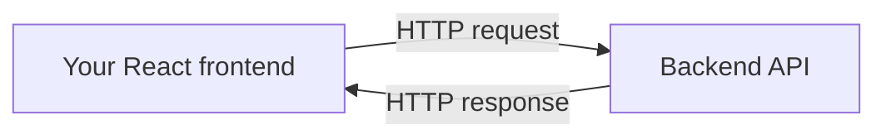
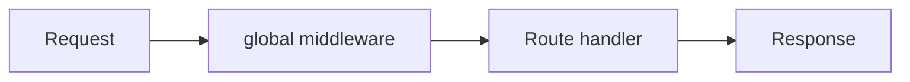

# Frontend Developer Guide

This guide teaches you the backend project as if you're a React developer who has never touched a
Node backend before. It uses plain language, analogies, and diagrams.

The backend is **plain JavaScript** (CommonJS) on Node.js 20 + Express + Mongoose. There is **no
TypeScript, no build step, and no DI framework**.

---

## 0. The Big Picture

Think of the backend as a **restaurant kitchen**. Your React app is the **customer**.



When the React app calls an API, it sends an HTTP request. The backend receives it, processes it,
and returns an HTTP response (JSON).

---

## 1. What Exists Today (honest scope)

Story 0.2 is a **backend initial setup**. It deliberately ships **no business endpoints** — only:

- `GET /api/health` → `{ "status": "OK" }` (liveness check).
- Swagger UI at `/api-docs`.
- Clean Architecture folder scaffolding ready for future business features (CQRS).

Don't be surprised there are no `/api/users`, `/api/orders`, etc. yet — those come in later stories.

---

## 2. How the Server Starts (quick version)

`npm run dev` → runs `src/server.js` (via `node --watch`) → connects to MongoDB → starts Express
listening on port `3000`.

You don't need to change anything here. Just know: **if the database can't be reached or `.env` is
misconfigured, the server won't start** (it exits with code 1).

---

## 3. How Routing Works

Routes are like a **mail-room directory**: given a URL, they decide WHICH handler to send it to.

- `src/api/routes/index.js` mounts feature routers: `router.use(require('./health.routes'))`.
- `src/api/routes/health.routes.js` defines the endpoint:

```js
router.get('/health', asyncHandler(async (req, res) => {
  res.status(200).json({ status: 'OK' });
}));
```

That route is mounted under `/api`, so the full path is `GET /api/health`.

Analogy: Express paths map to URLs exactly like React Router — `/api/health` is a URL you hit with
`fetch('/api/health')`.

---

## 4. How Middleware Works

Middleware are **checkpoints** a request passes through. They can inspect, modify, or reject a request
before it reaches a route handler.



In `src/app.js`, global middleware runs on every request:

- `helmet()` — adds security headers.
- `cors()` — allows requests from other origins (your React dev server).
- `compression()` — gzips the response.
- `express.json()` — parses the JSON body into `req.body`.
- `requestLogger` (dev only) — logs each request.

The `middlewares/` folder also has:
- `validate.js` — a Zod schema validator for future routes (checks `req.body`/`req.query`/`req.params`
  against a schema; returns `400` if invalid).
- `error-handler.js` — the global error handler and 404 handler.

---

## 5. What "Plain JavaScript" Means Here

Everything is CommonJS:

```js
// import
const { logger } = require('./shared/utils/logger');

// export
module.exports = { myFunction };
```

- No `.ts` files, no types, no `tsconfig`.
- It runs directly with `node` — no compile/build step.
- Best practices are documented in each file's `docs/files/**` doc.

---

## 6. How Mongoose Connects

Mongoose is the tool that talks to MongoDB. In this setup there are **no models yet**, only the
connection (`src/infrastructure/database/mongoose/connection.js`):

```js
await mongoose.connect(config.mongoUri, { dbName: 'thewovencloudkitchen', autoIndex: !isProd });
```

Future stories will add Mongoose schemas/models in `src/infrastructure/database/models/`.

---

## 7. How the Response / Error Shape Works

The API wraps responses consistently (see `src/shared/utils/response.js`):

| Helper | status | Shape |
| --- | --- | --- |
| `successResponse(res, data, message)` | 200 | `{ success, data, message? }` |
| `createdResponse(res, data, message)` | 201 | `{ success, data, message }` |
| `noContentResponse(res)` | 204 | empty |
| `errorResponse(res, message, status, details)` | custom | `{ success:false, message, errors? }` |
| `paginatedResponse(res, data, pagination)` | 200 | `{ success, data, pagination }` |

Errors are normalized through the `AppError` hierarchy (`src/shared/errors/`):
`NotFoundError` (404), `ValidationError` (400), `ConflictError` (409), `InternalError` (500).

Global error response shape:

```json
{
  "success": false,
  "message": "...",
  "code": "NOT_FOUND"
}
```

So in React you can rely on `res.success`, read `res.code` to handle categories, and read `res.message`.

---

## 8. How the Health Check Works (a working example)

```
fetch('/api/health')  →  200 { "status": "OK" }
```

- No auth, no body, no query params.
- It's a plain inline route handler — no controller, no repository, no DB call.

---

## 9. Mapping to Your React Skills

| Backend concept | React / frontend analogy |
| --- | --- |
| Express route | React Router route |
| `req.body` | the payload you `JSON.stringify` in `fetch` |
| `req.query` | URL search params (`useSearchParams`) |
| Middleware | an axios interceptor / `useEffect` guard |
| Mongoose | an ORM / API client layer |
| `success:true` response | your API helper returning data |
| error `code` | an error enum you switch on in a catch block |

---

## 10. Common Gotchas for Frontend Developers

- **CORS:** already enabled via `cors()` — you won't hit CORS errors from a different dev port.
- **No business endpoints yet:** only `GET /api/health` and Swagger at `/api-docs` exist today.
- **Server won't start without:** MongoDB reachable **and** valid `.env` (a missing `MONGODB_URI`
  aborts startup).
- **Docs live in:** `GET /api-docs` (Swagger UI) and this `docs/` folder.

## Related Documents

- [00 - Project Startup Flow](00-project-startup-flow.md)
- [01 - Request Flow](01-request-flow.md)
- [API Docs](apis/) — exact endpoints to call
- [Database](database.md)
- [Architecture](architecture.md)
