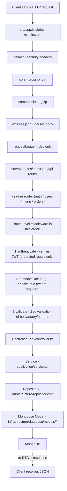
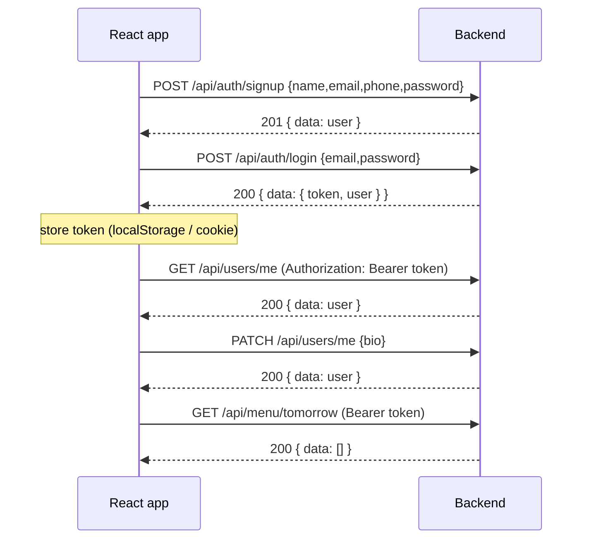

# Sprint 1 — Authentication, Signup & Role-Based Access Control (RBAC)

> Scope marker: this document describes everything shipped in **Sprint 1** of the backend. It explains
> **each feature**, the **exact order in which pieces are called** (the flow), and **how a frontend
> developer uses it**. It supersedes the "no business endpoints exist yet" caveat from the Story 0.2
> docs for anything listed in this file.

---

## 1. What Sprint 1 Delivers

| Capability | Endpoint | Authentication | Role(s) |
| --- | --- | --- | --- |
| Signup | `POST /api/auth/signup` | Public | anyone (always creates `CUSTOMER`) |
| Login | `POST /api/auth/login` | Public | anyone |
| Change password | `PATCH /api/auth/change-password` | Required | `ADMIN`, `CUSTOMER` |
| My profile | `GET /api/users/me` | Required | `ADMIN`, `CUSTOMER` |
| Update my profile | `PATCH /api/users/me` | Required | `ADMIN`, `CUSTOMER` |
| List users | `GET /api/users` | Required | `ADMIN` only |
| Get user by id | `GET /api/users/:id` | Required | `ADMIN` only |
| Update a user | `PATCH /api/users/:id` | Required | `ADMIN` only |
| Delete a user | `DELETE /api/users/:id` | Required | `ADMIN` only |
| View tomorrow's menu | `GET /api/menu/tomorrow` | Required | `ADMIN`, `CUSTOMER` |
| Manage menu (create/update/delete) | `POST /api/menu`, `PATCH/DELETE /api/menu/:id` | Required | `ADMIN` only (handler: later sprint) |
| Place order | `POST /api/orders` | Required | `ADMIN`, `CUSTOMER` (handler: later sprint) |
| List orders | `GET /api/orders` | Required | `ADMIN` (all) / `CUSTOMER` (own) |
| Get order | `GET /api/orders/:id` | Required | `ADMIN` (any) / `CUSTOMER` (own) |
| Update order status | `PATCH /api/orders/:id` | Required | `ADMIN` only (handler: later sprint) |

Read the full file path table in section 14 (Authorization Matrix).

### What is NOT in this sprint (by design)

- Menu/order **business logic** (models, handlers). The routes exist **only** to enforce the
  authorization boundaries now; mutations return `501 NOT_IMPLEMENTED`, reads return empty data.
- Email verification, password reset, OAuth, refresh tokens, session invalidation.
- Rate limiting, logging systems, Redis, background jobs.

---

## 2. Prerequisites & Quick Start

```bash
npm install                          # install dependencies (bcryptjs, jsonwebtoken added in Sprint 1)
cp .env.example .env                 # then fill in real values (see section 6)
npm run seed:admin                   # create the initial ADMIN user (idempotent)
npm run dev                          # start the API on http://localhost:3000
npm test                             # run the 56-node:test integration suite
npm run lint                         # ESLint on src + test
```

The API needs a running MongoDB (`mongodb://localhost:27017` by default — see `docker-compose.yml`
if you use Docker) and a valid `.env`. If either is missing, the server **exits at startup** because
the environment is validated with Zod in `src/config/index.js`.

---

## 3. The Global Flow: Who Is Called First

Every HTTP request runs through the same pipeline. The order below is the literal execution order in code.



Key rule: **middleware runs BEFORE the controller**. So authentication and authorization are enforced
before any business logic can execute. `asyncHandler` wraps every controller so any thrown error is
forwarded to the global error handler.

### The three kinds of flow

1. **Public flow** (`POST /api/auth/signup`, `POST /api/auth/login`)
   `global middleware → route → validate → controller → service → repository → model → MongoDB`.

2. **Protected user flow** (`GET/PATCH /api/users/me`, change-password, order reads)
   `global middleware → authenticate (401 if no/invalid token) → validate → controller → service → repository → model → MongoDB`.

3. **Admin-only flow** (`GET/PATCH/DELETE /api/users...`)
   `global middleware → authenticate → authorizeRoles('ADMIN') (403 if CUSTOMER) → validate → controller → service → repository → model → MongoDB`.

---

## 4. The Dependency Chain (Plain JavaScript)

Sprint 1 follows the existing Clean Architecture wiring with **no DI framework**. Dependencies are
composed explicitly in the route files:

```text
User Mongoose Model (infrastructure/database/models/user.model.js)
     ↓
User Repository  (infrastructure/repositories/user.repository.js)
     ↓
Auth / User Service (application/services/*.service.js)
     ↓
Auth / User Controller (api/controllers/*.controller.js)
     ↓
Routes (api/routes/*.routes.js)
```

Example of the explicit wiring (inside `src/api/routes/auth.routes.js`):

```js
const userRepository = createUserRepository(User);   // model → repository
const authService = createAuthService(userRepository); // repository → service
const authController = createAuthController(authService); // service → controller
router.post('/signup', validate({ body: signupSchema }), asyncHandler(authController.signup));
```

Every layer depends on the layer below through plain function arguments. There is **no** Inversify,
`reflect-metadata`, `Container`, or `container.get()`. If you can name the file, you can follow the
whole chain.

---

## 5. The User Model (`users` collection)

Defined in `src/infrastructure/database/models/user.model.js`.

| Field | Type | Required | Rules |
| --- | --- | --- | --- |
| `name` | String | ✅ | trimmed, 1–100 chars |
| `email` | String | ✅ | lowercase, valid format, **unique** |
| `phone` | String | ✅ | **required, unique**, Indian 10-digit (6–9 prefix), normalized |
| `password` | String | ✅ | bcrypt hash, never selected by default (`select: false`) |
| `role` | String | ✅ | enum `ADMIN` / `CUSTOMER`, defaults to `CUSTOMER` |
| `bio` | String | – | optional, max 500 chars |
| `isActive` | Boolean | – | defaults `true`; `false` blocks login |
| `createdAt` / `updatedAt` | Date | – | Mongoose timestamps |

### Phone number — the hard rule

- **Required for every user** — at validation (Zod), at the data layer (Mongoose `required`), and in
  services. Signup, admin user updates, and profile updates all enforce it.
- Rejected forms: missing, empty string, `null`, `undefined`, whitespace-only, or non-matching format.
- Accepted format: `9876543210`, optionally prefixed `+91` (e.g. `+91 98765 43210`). It is **normalized**
  to a canonical 10-digit string and stored that way.
- **Unique** by business decision: a phone belongs to exactly one account.

```js
// src/shared/utils/phone.js
normalizePhone('+91 98765 43210') // => '9876543210'
isValidPhone('1234567890')        // => false (starts with 1)
```

Password policy (shared constant in `src/shared/constants/password-policy.js`):

```
8–64 chars, at least one uppercase, one lowercase, one digit, no spaces
```

---

## 6. Environment Variables

Validated by Zod in `src/config/index.js`. See `.env.example`.

| Variable | Required | Purpose |
| --- | --- | --- |
| `PORT` | – | HTTP port (default `3000`) |
| `MONGODB_URI` | ✅ | MongoDB connection string |
| `DB_NAME` | – | Database name (default `thewovencloudkitchen`) |
| `API_PREFIX` | – | Route prefix (default `/api`) |
| `LOG_LEVEL` | – | Winston level |
| `JWT_SECRET` | ✅ | Secret used to sign/verify JWTs (min 16 chars, never commit real value) |
| `JWT_EXPIRES_IN` | – | Token lifetime (default `1d`) |
| `ADMIN_NAME` | – | Used only by `npm run seed:admin` |
| `ADMIN_EMAIL` | – | Seed admin email |
| `ADMIN_PASSWORD` | – | Seed admin password (must pass policy) |
| `ADMIN_PHONE` | ✅ | **Required** for seeding an admin (must be a valid phone) |

> Never commit real secrets. `.env` is gitignored; `.env.example` keeps placeholders only.

---

## 7. Feature Walkthrough (each feature: what, flow, how to call)

### 7.1 Signup — `POST /api/auth/signup`

**What it does.** Creates a new **CUSTOMER** account. Public.

**Call order (first → last):**
1. Globals in `src/app.js`.
2. `validate` middleware — parses body against `signupSchema` (Zod). Failure → `400 VALIDATION_ERROR`.
   - Missing / empty / `null` / invalid `phone` → `400` "Phone number is required" / format message.
   - Invalid email, weak password, or `bio` too long → `400`.
   - Unknown fields (e.g. `role`) are **stripped** — the client can never choose the role.
3. `authController.signup` (wrapped in `asyncHandler`).
4. `authService.signup`:
   a. `userRepository.emailExists(email)` → `409 ConflictError "Email already registered"`.
   b. Normalize phone; `userRepository.phoneExists(phone)` → `409 "Phone number is already registered"`.
   c. `hashPassword(password)` (bcrypt, 10 rounds).
   d. `userRepository.create({  ... role: CUSTOMER })`.
5. `User` Mongoose model → MongoDB (`users` collection). Role is always `CUSTOMER` regardless of body.
6. `createdResponse` → `201`.

**Request**
```http
POST /api/auth/signup
Content-Type: application/json

{
  "name": "Customer Name",
  "email": "customer@example.com",
  "phone": "9876543210",
  "password": "StrongPassword123",
  "bio": "Customer bio"
}
```

**Response (201)**
```json
{
  "success": true,
  "message": "Signup successful",
  "data": {
    "id": "6179...",
    "name": "Customer Name",
    "email": "customer@example.com",
    "phone": "9876543210",
    "role": "CUSTOMER",
    "bio": "Customer bio",
    "isActive": true,
    "createdAt": "2026-09-05T...",
    "updatedAt": "2026-09-05T..."
  }
}
```
`password` is **never** in the response.

**Demo of the security guard** — a Hacker sends `role: "ADMIN"`:
```json
{ "name": "Hacker", "email": "hacker@example.com", "phone": "9876543210",
  "password": "Password123", "role": "ADMIN" }
```
Result: still `201` with `role: "CUSTOMER"`. The `role` field is silently ignored (stripped by Zod).

### 7.2 Login — `POST /api/auth/login`

**What it does.** Verifies credentials and returns a JWT + safe user object (phone included). Public.

**Call order:**
1. `validate` — `loginSchema`.
2. `authController.login` → `authService.login`:
   a. `userRepository.findByEmail(email, { withPassword: true })` — explicitly selects `+password`.
   b. `comparePassword(password, hash)` (bcrypt). Fail → `401 UnauthorizedError "Invalid email or password"`.
   c. If `isActive === false` → `401 "Your account has been deactivated"`.
   d. `jwt.sign({ userId, role }, config.jwtSecret, { expiresIn: config.jwtExpiresIn })`.
3. `successResponse` → `200 { success, message, data: { token, user } }`.

**Request**
```http
POST /api/auth/login
Content-Type: application/json

{ "email": "customer@example.com", "password": "StrongPassword123" }
```

**Response (200)**
```json
{
  "success": true,
  "message": "Login successful",
  "data": {
    "token": "eyJhbGciOiJIUzI1NiIs...",
    "user": {
      "id": "6179...", "name": "Customer Name", "email": "customer@example.com",
      "phone": "9876543210", "role": "CUSTOMER", "bio": "Customer bio",
      "isActive": true, "createdAt": "...", "updatedAt": "..."
    }
  }
}
```

**JWT payload (decoded)** — only the minimum info:
```json
{ "userId": "6179...", "role": "CUSTOMER", "iat": 1767..., "exp": 1767... }
```

### 7.3 Change password — `PATCH /api/auth/change-password`

**What it does.** Authenticated users verify their current password and replace it with a new one.

**Call order:** `authenticate` (401 without token) → `validate` (both fields required, `newPassword`
must pass the policy) → `authController.changePassword` → `authService.changePassword`:
current password verified with bcrypt (`401 "Current password is incorrect"` if not) → hash the new
password → `userRepository.updateById`.

**Request**
```http
PATCH /api/auth/change-password
Authorization: Bearer <JWT>
Content-Type: application/json

{ "currentPassword": "OldPassword123", "newPassword": "NewPassword123" }
```

**Response (200)**
```json
{ "success": true, "message": "Password changed successfully", "data": {} }
```

After this change, the **old password no longer logs in**; the new one does. Existing JWTs remain
valid until expiry (Sprint 1 uses stateless tokens — token invalidation is a known TODO).

### 7.4 My profile — `GET /api/users/me`

**What it does.** Returns the authenticated user's own record. Works for `ADMIN` and `CUSTOMER`.

**Call order:** `authenticate` → `userController.getMe` → `userService.getProfile(req.user.userId)` →
`userRepository.findById` → DTO. The userId comes **only from the JWT**, never from the URL/body.

**Request**
```http
GET /api/users/me
Authorization: Bearer <JWT>
```

**Response (200)** — note `phone` is always present:
```json
{
  "success": true,
  "data": {
    "id": "6179...", "name": "Customer Name", "email": "customer@example.com",
    "phone": "9876543210", "role": "CUSTOMER", "bio": "Customer bio",
    "isActive": true, "createdAt": "...", "updatedAt": "..."
  }
}
```

### 7.5 Update my profile — `PATCH /api/users/me`

**What it does.** Updates **only** the authenticated user's `name`, `phone`, `bio`.

**Call order:** `authenticate` → `validate` (strict `updateMeSchema`) → `userController.updateMe` →
`userService.updateProfile(userId, body)` →
- phone (if provided): normalize + check `phoneExists` excluding self → 403 if taken.
- `userRepository.updateById` → updated DTO.

**Request**
```http
PATCH /api/users/me
Authorization: Bearer <JWT>
Content-Type: application/json

{ "name": "Updated Name", "phone": "9876543210", "bio": "Updated customer bio" }
```

**Response (200)** `{ success:true, message:"Profile updated successfully", data: {...user} }`

**What is blocked (all intentionally → `400 VALIDATION_ERROR` or `403`):**
- `phone: null` / `""` / `"12345"` → `400` (you may change your phone but never remove it).
- `role`, `email`, `password`, `isActive` → `400`. The schema is `.strict()`, so these keys are rejected.
- There is **no way** for a customer to pass a victim user id — `/me` always uses `req.user.userId`.
  Trying `PATCH /api/users/:id` as a customer hits `authorizeRoles('ADMIN')` → `403`.

### 7.6 List users (admin) — `GET /api/users`

**Call order:** `authenticate` → `authorizeRoles('ADMIN')` (CUSTOMER → `403 "Access denied"`) →
`validate` (query schema) → `userController.listUsers` → `userService.listUsers` →
`userRepository.list` (paged, optional `role` / `isActive` filters) → `paginatedResponse`.

**Request**
```http
GET /api/users?page=1&limit=10&role=CUSTOMER&isActive=true
Authorization: Bearer <ADMIN_JWT>
```

**Response (200)**
```json
{
  "success": true,
  "data": [ { ...user }, { ...user } ],
  "pagination": { "page": 1, "limit": 10, "total": 4, "pages": 1 }
}
```

### 7.7 Get user by id (admin) — `GET /api/users/:id`

`authenticate` → `authorizeRoles('ADMIN')` → `validate` (params: 24-hex id, else `400`) →
`userService.getUserById` → `userRepository.findById` → DTO.

- Valid but unknown id → `404 NotFoundError "User not found"`.
- Malformed id (e.g. `not-a-valid-id`) → `400`.

### 7.8 Update a user (admin) — `PATCH /api/users/:id`

**Editable by admin:** `name`, `phone`, `bio`, `role`, `isActive`.

**Phone rule:** `phone: ""`, `null`, or invalid → `400`. An admin **cannot** blank a user's phone.
A phone already belonging to another user → `403 "Phone number is already in use"`.

**Self-protection guards (admin acting on their own account):**
- Deactivating self → `403 "You cannot deactivate your own account"`.
- Changing own role → `403 "You cannot change your own role"`.
- (See also deletion guard in 7.9.)

**Request**
```http
PATCH /api/users/6179...
Authorization: Bearer <ADMIN_JWT>
Content-Type: application/json

{ "isActive": false }
```
Deactivating sets `isActive: false`; that user's next login fails with `401`.

### 7.9 Delete a user (admin) — `DELETE /api/users/:id`

Hard-deletes the user document. Cannot delete your own account (`403`). Unknown id → `404`.

### 7.10 Menu — authorization boundaries

| Endpoint | Who | Result |
| --- | --- | --- |
| `GET /api/menu/tomorrow` | `ADMIN`, `CUSTOMER` | `200` with `data: []` (empty — menu model is a later sprint) |
| `POST /api/menu` | `ADMIN` only | `501 NOT_IMPLEMENTED` |
| `PATCH /api/menu/:id` | `ADMIN` only | `501 NOT_IMPLEMENTED` |
| `DELETE /api/menu/:id` | `ADMIN` only | `501 NOT_IMPLEMENTED` |

A customer hitting any write endpoint gets `403 Forbidden` — the authorization boundary is already
enforced, so later sprints only need to fill in handlers.

### 7.11 Orders — authorization boundaries

| Endpoint | Who | Result |
| --- | --- | --- |
| `POST /api/orders` | `ADMIN`, `CUSTOMER` | `501 NOT_IMPLEMENTED` (placement is a later sprint) |
| `GET /api/orders` | `ADMIN` (all) / `CUSTOMER` (own) | `200` with empty `data` + pagination |
| `GET /api/orders/:id` | `ADMIN` (any) / `CUSTOMER` (own) | `404 "Order not found"` |
| `PATCH /api/orders/:id` | `ADMIN` only | `501 NOT_IMPLEMENTED` |

Customer isolation (own orders only) is guaranteed by filtering on the JWT `userId` — the backend
never trusts a `userId` the client sends.

---

## 8. Authentication Middleware — `authenticate` (`src/api/middlewares/authenticate.js`)

Runs on every protected route. Executes **before** any controller.

Recap of "what is called first" for protected routes:
1. `authenticate` reads `Authorization: Bearer <token>`.
2. It calls `jwt.verify(token, config.jwtSecret)`.
3. On success it attaches `req.user = { userId, role }` and calls `next()`.
4. On failure (missing / malformed / wrong secret / expired token) → `401 UnauthorizedError
   "Authentication required"`.

```json
{ "success": false, "message": "Authentication required", "code": "UNAUTHORIZED" }
```

JWT expiry = `JWT_EXPIRES_IN` (default `1d`). Expired tokens produce the same `401`.

---

## 9. Role-Based Authorization — `authorizeRoles` (`src/api/middlewares/authorize-roles.js`)

Used **after** `authenticate`. Reads `req.user.role` from the verified token and compares it to the
allowed roles passed by the route:

```js
authorizeRoles('ADMIN')              // admin only
authorizeRoles('ADMIN', 'CUSTOMER')  // both roles
```

- Not in the allowed list → `403 ForbiddenError "Access denied"`.
- No `req.user` at all → `401` (should be unreachable if `authenticate` ran first).

```json
{ "success": false, "message": "Access denied", "code": "FORBIDDEN" }
```

The same check is what prevents a customer from reaching `/api/users` and order/menu mutations.

---

## 10. Admin Bootstrap — `npm run seed:admin`

Creates the initial `ADMIN` account from environment variables. Reads:

```env
ADMIN_NAME=Root Admin
ADMIN_EMAIL=admin@example.com
ADMIN_PASSWORD=...        # must pass the password policy
ADMIN_PHONE=9876543210    # required
```

How it works (`src/infrastructure/scripts/seed-admin.js`):
1. Validates all values (name, valid email, password policy, **phone required + valid**), then exits
   with code 1 on failure.
2. Connects to MongoDB.
3. If a user with the admin email already exists → logs "already exists, Skipping." (idempotent).
4. Otherwise hashes the password and inserts `role: ADMIN`.

> Real credentials must never be committed. Keep them in the local gitignored `.env`.
>
> A normal signup can **never** produce an admin — creating roles other than `CUSTOMER` is only
> possible through this seed or the admin `PATCH /api/users/:id` endpoint.

---

## 11. Error Handling & Response Shapes

All responses follow the existing standard (`src/shared/utils/response.js` and `src/shared/errors/`):

**Success:**
```json
{ "success": true, "data": {}, "message": "optional" }
```
List responses add `pagination`; signup returns `201`.

**Error:**
```json
{ "success": false, "message": "human readable", "code": "MACHINE_CODE", "errors": [ { "field": "...", "message": "..." } ] }
```

| Code | HTTP | Typical cause |
| --- | --- | --- |
| `VALIDATION_ERROR` | 400 | invalid/missing phone, weak password, bad email, malformed id, disallowed field |
| `UNAUTHORIZED` | 401 | missing/invalid/expired token, wrong password, deactivated account |
| `FORBIDDEN` | 403 | customer on admin route, phone taken, admin self-protection |
| `NOT_FOUND` | 404 | unknown route, unknown user, unknown order |
| `CONFLICT` | 409 | duplicate email or phone |
| `NOT_IMPLEMENTED` | 501 | menu/order handlers (later sprint) |
| `INTERNAL_ERROR` | 500 | unexpected error (generic message in production) |

Sensitive data (password hashes, JWT secrets, stack traces) is **never** included in responses, and
stack traces only appear in non-production environments.

---

## 12. Tests & Verification

Command: `npm test` → Node's built-in test runner (no extra framework).

Coverage (56 subtests in `test/sprint1.test.js`):
- Signup: valid → CUSTOMER + hashed password; missing/empty/null/invalid phone → 400; duplicate
  email → 409; invalid email/password → 400; `role: ADMIN` ignored; `+91` normalized; unique phone → 409.
- Login: customer & admin succeed and **include phone**; wrong password / unknown email / deactivated
  user → 401; JWT decodes to `{ userId, role }`.
- Auth middleware: missing / invalid / **expired** token → 401.
- Authorization: customer on admin endpoints → 403 everywhere; admin on admin & customer endpoints → 200.
- Profile: view/update own (name, bio, phone); cannot null/empty/invalid phone; cannot send `role`;
  cannot touch another user via their id; change-password flow (wrong current → 401, then old password
  stops working).
- Admin: list (paged + role filter), get by id, deactivate → login blocked, valid phone required,
  cannot deactivate/change-role/delete self, delete works.
- Menu/Orders: auth required; customer writes → 403; admin writes → 501; reads → empty/404.

Lint: `npm run lint` must be clean (ESLint flat config, `src` + `test`).

---

## 13. API Documentation

- **Swagger UI:** http://localhost:3000/api-docs (all Sprint 1 endpoints documented, bearer-auth
  scheme included).
- **In-code:** OpenAPI spec generated in `src/config/swagger.js` via `swagger-jsdoc`.
- **Per-file coverage:** see `docs/files/**` (Story 0.2 scaffolding) and this document for the flows.

---

## 14. Authorization Matrix (Sprint 1)

| API | Public | Customer | Admin |
| --- | :-: | :-: | :-: |
| `POST /api/auth/signup` | ✅ | ✅ | ✅ |
| `POST /api/auth/login` | ✅ | ✅ | ✅ |
| `PATCH /api/auth/change-password` | ❌ | ✅ | ✅ |
| `GET /api/users/me` | ❌ | ✅ | ✅ |
| `PATCH /api/users/me` | ❌ | ✅ | ✅ |
| `GET /api/users` | ❌ | ❌ | ✅ |
| `GET /api/users/:id` | ❌ | ❌ | ✅ |
| `PATCH /api/users/:id` | ❌ | ❌ | ✅ |
| `DELETE /api/users/:id` | ❌ | ❌ | ✅ |
| `GET /api/menu/tomorrow` | ❌ | ✅ | ✅ |
| `POST /api/menu` | ❌ | ❌ | ✅ |
| `PATCH /api/menu/:id` | ❌ | ❌ | ✅ |
| `DELETE /api/menu/:id` | ❌ | ❌ | ✅ |
| `POST /api/orders` | ❌ | ✅ | ✅ |
| `GET /api/orders` | ❌ | ✅ (own) | ✅ (all) |
| `GET /api/orders/:id` | ❌ | ✅ (own) | ✅ (any) |
| `PATCH /api/orders/:id` | ❌ | ❌ | ✅ |

---

## 15. Realistic Frontend Workflow (the order you would call things)



1. **Signup first.** The very first call a new user makes. Validates the mandatory phone, hashes the
   password, returns a `CUSTOMER` profile.
2. **Login second.** Exchanges email + password (or call this first if the user already exists) for a
   JWT. Every protected call after this carries `Authorization: Bearer <token>`.
3. **Visit `/api/users/me`** using the token — demonstrates the authenticated path (401 without token).
4. **Update profile / change password / order & menu reads** all use the same token.
5. **Admin-only calls** require a token whose `role` is `ADMIN`, obtained by logging in with an admin
   account (created via `npm run seed:admin` or by another admin).

---

## 16. Key Files at a Glance

| Concern | File |
| --- | --- |
| User schema | `src/infrastructure/database/models/user.model.js` |
| Data access | `src/infrastructure/repositories/user.repository.js` |
| Auth logic (signup/login/change-password) | `src/application/services/auth.service.js` |
| User logic (profile/list/get/update/delete) | `src/application/services/user.service.js` |
| HTTP controllers | `src/api/controllers/auth.controller.js`, `user.controller.js`, `menu.controller.js`, `order.controller.js` |
| JWT + role middleware | `src/api/middlewares/authenticate.js`, `authorize-roles.js` |
| Zod schemas | `src/shared/validators/auth.validator.js`, `user.validator.js` |
| Phone handling | `src/shared/utils/phone.js` |
| Password policy + hashing | `src/shared/constants/password-policy.js`, `src/shared/utils/password.js` |
| Roles + error codes | `src/shared/constants/roles.js`, `error-codes.js` |
| Routes | `src/api/routes/auth.routes.js`, `user.routes.js`, `menu.routes.js`, `order.routes.js`, `index.js` |
| Admin seed | `src/infrastructure/scripts/seed-admin.js` |
| Env (Zod) | `src/config/index.js` |
| OpenAPI | `src/config/swagger.js` |
| Tests | `test/sprint1.test.js` |

## Related Documents

- [00 - Project Startup Flow](00-project-startup-flow.md)
- [01 - Request Flow](01-request-flow.md)
- [Frontend Developer Guide](frontend-developer-guide.md)
- [Architecture](architecture.md)
- [Database](database.md)
- [API docs](apis/)